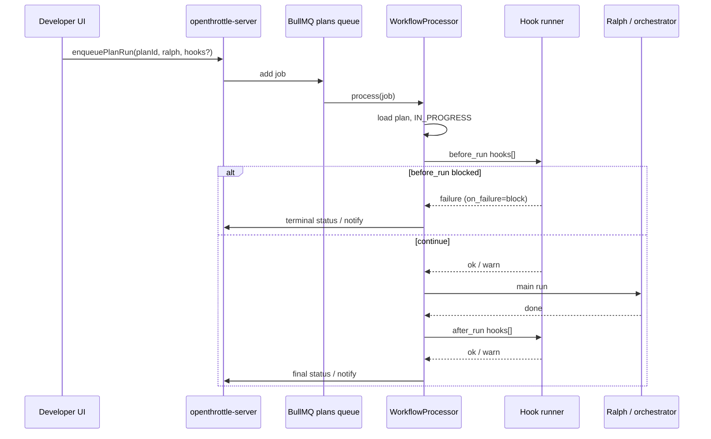
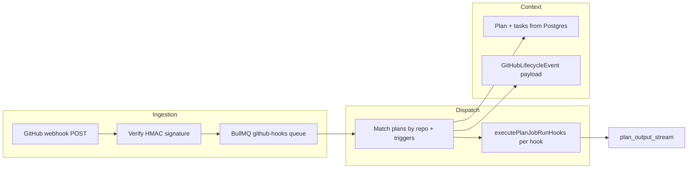

# Job run lifecycle hooks

> **OpenThrottle plan:** `0bd23aba-ace8-464c-ae77-363356451b3a` — _Job run lifecycle hooks (OT prompt/skill before & after)_  
> Update this document as tasks complete; tasks live in OT, not here.

## Problem

Today, a plan/workflow job run starts Ralph (spawn or in-process orchestrator) with optional **layer-1 prompt profile** tuning on the main run (`--prompt`, `--prompt-file`, `.workflow-ralph.json`). There is no first-class way to run a **separate** OpenThrottle prompt or repo **skill** immediately **before** or **after** the job, without folding that logic into the Ralph loop itself.

We want composable **lifecycle hooks** so plans can, for example:

- Run a short “preflight” skill before Ralph touches the repo
- Summarize or file follow-ups via a prompt profile after the job finishes
- Eventually react to **GitHub** events (PR opened, CI done, merge) with the same hook runner

**Phase 1 (this plan):** `before_run` and `after_run` on BullMQ plan jobs (`WorkflowProcessor`, spawn + orchestrator).  
**Phase 2 (backlog):** GitHub webhooks / lifecycle triggers reusing the same hook configuration and runner.

## Glossary

| Term         | Meaning                                                                                                                                 |
| ------------ | --------------------------------------------------------------------------------------------------------------------------------------- |
| **Job run**  | One BullMQ job on the plans queue for a `planId` (`run-plan-spawn` or `run-plan-orchestrator`).                                         |
| **Hook**     | A configured invocation: phase + kind + target + failure policy.                                                                        |
| **Phase**    | `before_run` — after plan load, before Ralph/orchestrator; `after_run` — when the job finishes (any terminal outcome).                  |
| **Kind**     | `prompt_profile` — named `/agents/...` or prompt file (layer-1 style); `skill` — repo skill under `.agents/skills` or `.cursor/skills`. |
| **Main run** | Existing Ralph/orchestrator execution; hooks are orthogonal, not a replacement for layer-1 tuning on the main run.                      |

## Goals

1. **Configure per plan** — ordered list of hooks stored with the plan and sent on enqueue.
2. **Run at clear boundaries** — before_run / after_run only in phase 1.
3. **Reuse existing prompt resolution** — align with `ralph-prompt-resolution` and `PlanWorkflowConfigPrompt` (named vs file).
4. **Observable** — append hook output to the plan output stream; surface failures per `on_failure`.
5. **Safe defaults** — `before_run` failure can block the main run; `after_run` defaults to warn-only.

## Non-goals (phase 1)

- Replacing Ralph iteration loop or layer-1 prompt on the main run
- GitHub webhook ingestion (captured in backlog task only)
- Arbitrary shell commands without going through prompt/skill runner
- Hooks mid-iteration inside Ralph

## Current system (anchor points)

| Area               | Location                                                                                                   |
| ------------------ | ---------------------------------------------------------------------------------------------------------- |
| Enqueue plan run   | `PlansResolver.workflowPlanRun`, `buildRunPlanJobData`                                                     |
| Job processing     | `WorkflowProcessor.process` (`applications/openthrottle-server/src/queues/workflow/workflow.processor.ts`) |
| Job payload tuning | `RalphNestedRunTuningInput` in `applications/openthrottle-server/src/queues/plans/plans.types.ts`          |
| UI run config      | `PlanTabConfiguration`, `PlanWorkflowConfigPrompt`                                                         |
| Prompt resolution  | `tools/workflows/src/utils/ralph-prompt-resolution.ts`                                                     |
| Ralph design       | `docs/workflows/ralph-design.md`                                                                           |



## Hook configuration model (canonical)

**Source of truth:** `@tools/workflows` — `tools/workflows/src/types/job-run-lifecycle-hooks.ts` and `job-run-lifecycle-hooks-validation.ts` (exported from package root).

### Discriminated union (`JobRunHookEntry`)

| Variant | `kind`           | Target fields                                                                 |
| ------- | ---------------- | ----------------------------------------------------------------------------- |
| Named   | `prompt_profile` | `promptDelivery: 'named'`, `prompt` (e.g. `/agents/ralph`) — layer-1 `--prompt` |
| File    | `prompt_profile` | `promptDelivery: 'file'`, `promptFile` (repo-relative path) — layer-1 `--prompt-file` |
| Skill   | `skill`          | `skillPath` (repo-relative `SKILL.md` under `.agents/skills/` or `.cursor/skills/`) |

Shared on every entry:

| Field             | Type                                      | Notes                                                                 |
| ----------------- | ----------------------------------------- | --------------------------------------------------------------------- |
| `phase`           | `before_run` \| `after_run`               | Required                                                              |
| `onFailure`       | `block` \| `warn` \| `ignore` (optional)  | Default: `block` (before_run), `warn` (after_run)                     |
| `timeoutSeconds`  | positive int (optional)                   | Default **600**; max **604800** (7 days)                              |
| `order`           | non-negative int (optional)               | Sort within phase; default **0**                                      |
| `conditions`      | object (optional)                         | See below                                                             |

**Conditions** (`JobRunHookConditions`):

- `runKinds?: ('spawn' | 'orchestrator')[]` — omit = run on both job paths
- `whenMainRunSucceeded?: boolean` — **after_run only**; omit = any terminal outcome; `true` = main run succeeded; `false` = failed or blocked before start

**Limits:** max **10** hooks per phase, **20** total per plan.

**Wire / legacy parsing:** `parseJobRunHookEntry` accepts canonical fields or draft `target` (named prompt or skill path). File prompts require `promptDelivery: 'file'` or `promptFile`.

**Enqueue payload:** `jobRunHooks?: JobRunHooksConfig` sibling to `ralph` on `RunPlanJobData` / `RunPlanOrchestratorJobData`, resolved from plan at enqueue (optional `jobRunHooksJson` on `EnqueuePlanRunInput` overrides for one run).

### Alignment with `RalphNestedRunTuningInput`

| Main run (layer 1–3)     | Hook `prompt_profile`                                      |
| ------------------------ | ---------------------------------------------------------- |
| `prompt` / `--prompt`    | `promptDelivery: 'named'` + `prompt`                       |
| `promptFile` / `--prompt-file` | `promptDelivery: 'file'` + `promptFile`              |
| `backend`, `model`, …    | Optional `JobRunHookRunOptions` per hook (phase 1: inherit main run unless set) |

Hooks are **not** argv flags on nested `workflow-ralph`; the processor runs them in-process via `executeJobRunHooksPhase` / `executePlanJobRunHooks`.

### Resolved decisions (config model)

| Topic                         | Decision                                                                 |
| ----------------------------- | ------------------------------------------------------------------------ |
| Max hooks                     | 10 / phase, 20 total                                                     |
| Default timeout               | 600s per hook                                                            |
| `after_run` when main blocked | `whenMainRunSucceeded: false` runs; hooks with no condition still run    |
| `target` field                | Supported only in wire JSON for migration; canonical types use explicit fields |

### Resolved decisions (invocation — task `2271cd77-3ba9-4fc9-9977-2645b26ee2fa`)

| Topic | Decision |
| ----- | -------- |
| Execution model | **One agent iteration per hook** via `createCursorWorkflowRalphIterationRunner` → `runIterationAsync` (same backends as main run: `cursor` / `claude`). No multi-turn hook session in phase 1. |
| `prompt_profile` | `resolveRalphPromptFromSeed` in `@tools/workflows` (`ralph-prompt-resolution.ts`): `named` passes path string as layer-1; `file` reads UTF-8 from `cwd`. |
| `skill` | **Filesystem read** of repo-relative `SKILL.md` (`readJobRunHookSkillMarkdown`): strip YAML frontmatter, prefix with `# Repo skill: <path>`. **Not** MCP `FetchMcpResource` — keeps hooks deterministic, offline-friendly, and aligned with enqueue `requireTargetsExist`. |
| Plan context | **Yes** — `formatPlanAndTasksForPrompt` + `Plan-Id` + phase suffix appended after layer-1 (`buildJobRunHookAgentPrompt`). |
| Runner overrides | Phase 1: **inherit** main job `executionBackend` + `ralph.model` from BullMQ payload (`execute-plan-job-run-hooks.ts`). Per-hook `JobRunHookRunOptions` on entries deferred. |
| MCP / OT tools | Hooks do **not** call `link_commit`. Agent may use tools available to the iteration runner; no separate mcp-developer injection in phase 1. |
| Code | `tools/workflows/src/utils/job-run-hooks-runner.ts`; server wiring `applications/openthrottle-server/src/queues/job-run-hooks/execute-plan-job-run-hooks.ts`. |

### Open questions (later)

- [ ] Cap total wall time for all hooks in one job?
- [ ] Per-hook `JobRunHookRunOptions` on `JobRunHookEntry` (backend/model/project)?

## Invocation

| Kind             | Resolution                                                                      | Execution                                                                      |
| ---------------- | ------------------------------------------------------------------------------- | ------------------------------------------------------------------------------ |
| `prompt_profile` | `resolveJobRunHookLayer1Prompt` → `resolveRalphPromptFromSeed`                  | One iteration; full prompt = layer-1 + plan block + hook suffix              |
| `skill`          | `readJobRunHookSkillMarkdown(cwd, skillPath)` under `.agents/skills` or `.cursor/skills` | Same iteration runner as `prompt_profile`                                      |

Hooks should **not** call `link_commit`.

## Persistence & API

- **DB:** `plans.job_run_hooks` JSONB (`{ hooks: [...] }`), migration `043_add_job_run_hooks_to_plans.sql`
- **GraphQL read:** `PlanObject.jobRunHooksJson` (resolved from entity)
- **GraphQL write:** `UpdatePlanInput.jobRunHooksJson` (parse + validate via `parseJobRunHooksConfig`)
- **Enqueue:** `EnqueuePlanRunInput.jobRunHooksJson` / `EnqueuePlanRalphOrchestratorInput.jobRunHooksJson` optional override; else copy from plan; attached to BullMQ payload as `jobRunHooks`
- **Validation:** `enqueue-plan-job-run-hooks.ts` — `requireTargetsExist` for file prompts and skills when `workingDirectory` / `WORKSPACE_ROOT` cwd is known

## UI

**Plan detail → Configuration tab** (`PlanWorkflowConfigHooks`):

- Ordered list: phase, kind, target (named prompt / prompt file / skill path), on_failure, timeout
- Reorder within phase (up/down)
- **Save to plan** → `updatePlan` with `jobRunHooksJson`
- **Run plan** → `enqueuePlanRun` includes current hooks JSON from UI state (override for that run)
- Validation blocks run when hooks are invalid; CLI preview does not apply (server-only hooks)

## Failure semantics (draft)

| Phase        | `on_failure`         | Behavior                                                                              |
| ------------ | -------------------- | ------------------------------------------------------------------------------------- |
| `before_run` | `block` (default)    | Do not start main run; plan → failed or blocked per product choice                    |
| `before_run` | `warn`               | Log + notify; start main run                                                          |
| `after_run`  | `warn` (default)     | Log + notify; keep main run outcome                                                   |
| `after_run`  | `ignore`             | Swallow hook errors                                                                   |
| any          | `block` on after_run | Override main success? (TBD — likely still mark plan per main run, flag hook failure) |

## Phase 2: GitHub lifecycle triggers (backlog)

**Task:** `39541604-fb4a-4d56-bdca-fe0f7223f3a4` — requirements only; no implementation in phase 1.

### Goals

1. **Same hook runner** — Reuse `executeJobRunHooksPhase` / `executePlanJobRunHooks` (one agent iteration per hook, `prompt_profile` vs `skill`, plan output stream, `on_failure` policy).
2. **Event-driven boundaries** — Run hooks when GitHub signals repo/PR lifecycle changes, not only when a BullMQ plan job starts or ends.
3. **Plan-scoped configuration** — Extend plan hook storage (or sibling `github_lifecycle_hooks` JSONB) so hooks are versioned with the plan and editable in Developer UI.
4. **Traceability** — Correlate hook runs with webhook delivery id, PR number, head SHA, and optional `commit_links` after merge (align with Option A: `workflow-link-merge` on squash SHA).

### Non-goals (phase 2 draft)

- Replacing GitHub Actions or required status checks
- Running arbitrary shell on the server without prompt/skill runner
- Multi-repo fan-out from one webhook without explicit plan↔repo binding
- Real-time comment bots on every review thread event (defer `pull_request_review` unless scoped)

### Anchor points (today)

| Area | Location / notes |
| ---- | ---------------- |
| GitHub REST (read) | `@openthrottle/nestjs-github` — `GitHubService`, `GitHubController` (`GET github/repos/:owner/:repo/pulls`); GraphQL stats in `github-stats.service.ts` |
| Webhook precedent | `@openthrottle/nestjs-stripe` — raw body + signature verification, idempotent handler, HTTP controller + optional GraphQL mutation |
| Plan ↔ repo | `plans.project` / `projectId`; workspace local repos (`workspace-local-repositories`); commit links (`commit_links.repo`, `commit_links.sha`) |
| Phase 1 runner | `tools/workflows/src/utils/job-run-hooks-runner.ts`, server `execute-plan-job-run-hooks.ts` |
| Post-merge link | `pnpm exec workflow-link-merge --plan <uuid> --sha <squash> --repo owner/repo` |

There is **no** GitHub App webhook receiver in openthrottle-server today; phase 2 adds ingestion (new module or extend `nestjs-github`).

### Proposed trigger model

Extend the discriminated union with a **`trigger`** dimension (orthogonal to `kind` / target fields):

| Trigger (draft) | GitHub event(s) | Typical use |
| --------------- | ----------------- | ----------- |
| `on_pr_opened` | `pull_request` action `opened`, `reopened` | Preflight skill, label bot instructions |
| `on_pr_synchronize` | `pull_request` action `synchronize` | Re-run checks summary hook on new commits |
| `on_pr_ready_for_review` | `pull_request` action `ready_for_review` | Notify / assign reviewer prompt |
| `on_ci_completed` | `check_run` completed or `check_suite` completed | Summarize CI, open follow-up task in OT |
| `on_pr_merged` | `pull_request` action `closed` + `merged=true` | Post-merge summary; pair with `workflow-link-merge` |
| `on_push_default_branch` | `push` to configured default branch | Release notes / deploy prep skill |

**Job-run phases remain** `before_run` / `after_run` on BullMQ jobs. **GitHub triggers** are a separate enum so conditions and defaults can differ (e.g. no `runKinds` filter; use `repos` / `branches` instead).



### Event context payload (`GitHubLifecycleEvent`)

Passed into `buildJobRunHookAgentPrompt` (or successor) as structured suffix after plan block:

| Field | Source | Notes |
| ----- | ------ | ----- |
| `deliveryId` | `X-GitHub-Delivery` | Idempotency key |
| `event` | `X-GitHub-Event` | e.g. `pull_request`, `check_run` |
| `action` | payload `action` | e.g. `opened`, `completed` |
| `repository` | `owner/login`, `name`, `full_name` | Match key for plan binding |
| `pullRequest` | number, title, `head.sha`, `base.ref`, `html_url`, `user.login` | Omit for non-PR events |
| `checkRun` | name, conclusion, `details_url`, `head_sha` | For `on_ci_completed` |
| `sender` | `login` | Actor |
| `receivedAt` | server timestamp | Audit |

Hooks should receive **enough** context to call `gh` or GitHub API without re-fetching everything, but keep payload size bounded (no full diff in phase 2).

### Plan binding and matching

A webhook affects zero or more plans. Draft rules (product TBD):

1. **Explicit repo on plan** — New optional `githubRepository: "owner/repo"` (or derive from linked `project` / workspace settings).
2. **Trigger filter** — Hook entry lists `trigger: on_pr_merged` (etc.); skip if event does not match.
3. **Branch / path conditions** (phase 2 extension of `JobRunHookConditions`):
   - `baseBranches?: string[]` — e.g. `main` only for merge hooks
   - `headRefPrefixes?: string[]` — e.g. `ot-lifecycle/`, `ralph/`
   - `labels?: string[]` — require PR labels (needs label on `pull_request` payload or follow-up API call)
4. **Plan-Id in PR body** — Optional convention: parse `Plan-Id: <uuid>` from PR description (same as commit footer) to disambiguate when multiple plans share a repo.

**Open:** Index plans by `githubRepository` vs scan all plans with hooks (acceptable at low volume; add GIN/jsonb index later).

### Configuration storage (options)

| Option | Pros | Cons |
| ------ | ---- | ---- |
| A. Same `job_run_hooks` array with `phase` renamed to `trigger` union | One UI list | Mixes job and GH semantics; migration noisy |
| B. `plans.github_lifecycle_hooks` JSONB sibling | Clear separation; phase 1 unchanged | Two lists in UI |
| C. Top-level `lifecycle_hooks` with `source: 'job_run' \| 'github'` | Single future UI | Larger schema change |

**Recommendation (draft):** **B** — `githubLifecycleHooksJson` mirrors `jobRunHooksJson` shape (`hooks[]` with `trigger` instead of `before_run`/`after_run`), shared validation helpers in `@tools/workflows`.

### Execution path

1. **Receive** — `POST /webhooks/github` (or GraphQL `processGitHubWebhook` like Stripe) with raw body; verify `X-Hub-Signature-256` using `GITHUB_WEBHOOK_SECRET`.
2. **Normalize** — Map payload → `GitHubLifecycleEvent` + list of matched `(planId, hook entries)`.
3. **Enqueue** — `github-lifecycle-hooks` BullMQ job `{ planId, hooks, event, cwd? }` (async; avoid blocking webhook ACK > 10s).
4. **Run** — Worker calls same `executePlanJobRunHooks` with `phase` replaced by trigger label in logs; **no main Ralph run** unless a hook explicitly enqueues `enqueuePlanRun` (out of scope for default triggers).
5. **Record** — Append to plan output stream prefix `[github:<trigger>]`; optional row in `github_hook_deliveries` for dedup/audit.

**Idempotency:** Store `deliveryId` + `planId` + hook index; skip duplicate processing on webhook retry.

**Failure policy:** Default `on_failure: warn` for GitHub-triggered hooks (do not block GitHub’s webhook retry). `block` only meaningful if hook chains into another queued job.

### Security and operations

- Verify signatures on every delivery; reject if secret unset in production.
- Restrict which repos the App/installation may send (GitHub App installation repos vs org-wide).
- Rate-limit per `repository` + `event` to prevent storms on busy monorepos.
- Do not log full webhook bodies in production (PII / tokens).
- `GITHUB_TOKEN` for optional follow-up API calls — same token as `GitHubService` today.

### Developer UI (phase 2)

- New subsection under Plan Configuration: **GitHub lifecycle hooks** (trigger, kind, target, conditions, on_failure).
- Repo field on plan or project picker (`owner/repo`).
- Test button: “Simulate event” with fixture JSON (dev only) — enqueue dry-run job.

### Relationship to phase 1 job hooks

| Aspect | Phase 1 (`before_run` / `after_run`) | Phase 2 (GitHub triggers) |
| ------ | ------------------------------------ | ------------------------- |
| Invoker | `WorkflowProcessor` / `PlansProcessor` | Webhook → BullMQ worker |
| Main Ralph run | Always (unless `before_run` blocks) | None by default |
| Conditions | `runKinds`, `whenMainRunSucceeded` | `baseBranches`, labels, repo match |
| cwd | Job `workingDirectory` / worktree | Plan workspace root or default clone path |
| Output stream | Yes | Yes, with github prefix |

### Implementation checklist (when scoped)

- [ ] GitHub App or org webhook registration + secret management
- [ ] Webhook controller + signature verification (mirror Stripe module)
- [ ] `GitHubLifecycleEvent` types + normalizers per event family
- [ ] Plan binding query + `github_lifecycle_hooks` migration
- [ ] BullMQ queue + processor
- [ ] Extend `buildJobRunHookAgentPrompt` with event suffix
- [ ] GraphQL read/write + Developer UI
- [ ] Dedup table + metrics
- [ ] Docs + manual test matrix (webhook fixtures)
- [ ] Optional: auto `workflow-link-merge` on `on_pr_merged` when squash SHA present

### Open questions (phase 2)

- [ ] GitHub App vs repository webhook vs org-level — which matches OpenThrottle deployment?
- [ ] Should `on_ci_completed` filter by check name (e.g. only `continuous-integration`)?
- [ ] Run hooks on fork PRs (`pull_request` from fork) — security implications for cwd?
- [ ] Multi-plan match: run all hooks in parallel or serial per delivery?
- [ ] Link to OT task status updates from hook agent (MCP) — allowed or forbidden?

## OT tasks

| Task                                 | ID                                     |
| ------------------------------------ | -------------------------------------- |
| Scaffold this doc                    | `f9220e7e-b418-4397-a6e1-9077f4462b74` |
| Define hook configuration model      | `9b475ece-83c3-47c1-9688-f10c2fc76970` ✓ |
| Persist hooks on plan (GraphQL + DB) | `27531221-c6e9-4b5c-b0d0-f7a654a720de` ✓ |
| Execute before_run hooks             | `1d469579-5412-4b35-85c8-97d44767aa95` ✓ |
| Execute after_run hooks              | `4c05a32b-fe85-499e-a409-efe09f537524` ✓ |
| Developer UI                         | `b6115296-102b-4f8b-8d0a-0c61bab0799d` ✓ |
| Invoke prompt vs skill               | `2271cd77-3ba9-4fc9-9977-2645b26ee2fa` ✓ |
| Tests and acceptance                 | `fc4bf925-bc18-4237-9100-73a6129e0c72` ✓ |
| Future: GitHub triggers              | `39541604-fb4a-4d56-bdca-fe0f7223f3a4` ✓ |

## Manual test plan (phase 1 acceptance)

Prerequisites: migration `043_add_job_run_hooks_to_plans.sql` applied; `openthrottle-server` + `openthrottle-developer` running; plan with at least one task.

| # | Scenario | Steps | Expected |
| - | -------- | ----- | -------- |
| 1 | No hooks | Plan with empty hooks; Run plan (spawn) | Same as pre-feature: main run starts immediately; no hook lines in plan output stream |
| 2 | `before_run` success | Add `before_run` → `prompt_profile` → `/agents/ralph`, `on_failure: warn`; Save; Run plan | Plan output shows hook start/complete; main Ralph run starts; plan ends per main outcome |
| 3 | `before_run` block | `before_run` with `on_failure: block`; use a hook that fails (invalid target or agent error) | Main run does not start; plan → `BLOCKED`; `after_run` still runs; queue notification mentions blocked |
| 4 | `after_run` on success | `after_run` → skill (e.g. `.agents/skills/workflow-ralph/SKILL.md`); complete main run successfully | Plan status reflects main run; hook output appended after main metrics; success notification unchanged in severity |
| 5 | `after_run` condition | Two hooks: `whenMainRunSucceeded: true` and `false`; fail main run once, succeed once | Only the matching hook runs each time (check plan output labels) |
| 6 | Orchestrator path | Same hook list; Run orchestrator (`enqueuePlanRalphOrchestrator` or UI equivalent) | Hooks run with `runKind: orchestrator`; `runKinds: ['spawn']` hooks skipped |
| 7 | Enqueue override | Plan hooks A; enqueue with override JSON B | Job uses B for that run only; plan storage still A after run |
| 8 | UI validation | Empty skill path or invalid prompt; click Run | Run blocked client-side; server rejects bad `jobRunHooksJson` on save/update |

### Automated coverage (reference)

| Area | Test file |
| ---- | --------- |
| Config parse/validate | `tools/workflows/src/utils/__tests__/job-run-lifecycle-hooks-validation.test.ts` |
| Phase runner | `tools/workflows/src/utils/__tests__/job-run-hooks-runner.test.ts` |
| Server executor wiring | `applications/openthrottle-server/src/queues/job-run-hooks/execute-plan-job-run-hooks.test.ts` |
| Processor integration (mocked hooks) | `applications/openthrottle-server/src/queues/plans/plans.processor.test.ts` |
| Enqueue / GraphQL JSON | `enqueue-plan-job-run-hooks.test.ts`, `plans.resolver.test.ts`, `enqueue-plan-ralph-tuning.test.ts` |
| Developer UI serialize/validate | `job-run-hooks-ui.test.ts`, `PlanWorkflowConfigHooks.test.tsx`, `plans.$planId._index.action.test.ts` |

Run (from repo root):

```bash
pnpm nx run workflows:test
pnpm nx run openthrottle-server:test
pnpm nx run openthrottle-developer:test
```

## Changelog

| Date       | Change                                                         |
| ---------- | -------------------------------------------------------------- |
| 2026-05-20 | Initial scaffold (plan `0bd23aba-ace8-464c-ae77-363356451b3a`) |
| 2026-05-20 | Canonical hook types + validation in `@tools/workflows` (task `9b475ece-83c3-47c1-9688-f10c2fc76970`) |
| 2026-05-20 | `before_run` execution in `WorkflowProcessor` / `PlansProcessor` via `executeJobRunHooksPhase` + `runBeforeRunHooksAndHandleBlock` (task `1d469579-5412-4b35-85c8-97d44767aa95`) |
| 2026-05-20 | `after_run` via `runAfterRunHooks` / `runAfterRunHooksThenNotify` + `completePlanRunWithHooks` on all terminal paths (spawn, orchestrator, worktree); blocked runs run `after_run` before BLOCKED notify (task `4c05a32b-fe85-499e-a409-efe09f537524`) |
| 2026-05-20 | Hook runner: `resolveJobRunHookLayer1Prompt`, skill frontmatter strip, `buildJobRunHookAgentPrompt`, server `executePlanJobRunHooks` single iteration (task `2271cd77-3ba9-4fc9-9977-2645b26ee2fa`) |
| 2026-05-20 | Tests + manual acceptance table: validation limits, `execute-plan-job-run-hooks.test.ts`, processor/enqueue/UI tests documented (task `fc4bf925-bc18-4237-9100-73a6129e0c72`) |
| 2026-05-20 | Phase 2 backlog: GitHub webhook triggers, event payload, plan binding, storage options, execution checklist (task `39541604-fb4a-4d56-bdca-fe0f7223f3a4`) |
