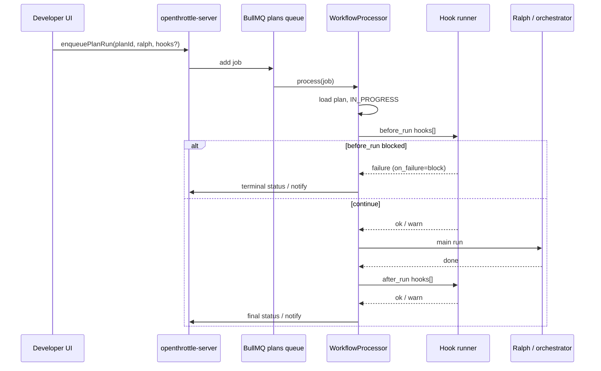

# Job run lifecycle hooks

> **OpenThrottle plan:** `0bd23aba-ace8-464c-ae77-363356451b3a` — _Job run lifecycle hooks (OT prompt/skill before & after)_  
> Update this document as tasks complete; tasks live in OT, not here.

## Problem

Today, a plan/workflow job run starts Ralph (spawn or in-process orchestrator) with optional **layer-1 prompt profile** tuning on the main run (`--prompt`, `--prompt-file`, `.workflow-ralph.json`). There is no first-class way to run a **separate** OpenThrottle prompt or repo **skill** immediately **before** or **after** the job, without folding that logic into the Ralph loop itself.

We want composable **lifecycle hooks** so plans can, for example:

- Run a short “preflight” skill before Ralph touches the repo
- Summarize or file follow-ups via a prompt profile after the job finishes
- Eventually react to **GitHub** events (PR opened, CI done, merge) with the same hook runner

**Phase 1 (this plan):** `before_run` and `after_run` on BullMQ plan jobs (`WorkflowProcessor`, spawn + orchestrator).  
**Phase 2 (backlog):** GitHub webhooks / lifecycle triggers reusing the same hook configuration and runner.

## Glossary

| Term         | Meaning                                                                                                                                 |
| ------------ | --------------------------------------------------------------------------------------------------------------------------------------- |
| **Job run**  | One BullMQ job on the plans queue for a `planId` (`run-plan-spawn` or `run-plan-orchestrator`).                                         |
| **Hook**     | A configured invocation: phase + kind + target + failure policy.                                                                        |
| **Phase**    | `before_run` — after plan load, before Ralph/orchestrator; `after_run` — when the job finishes (any terminal outcome).                  |
| **Kind**     | `prompt_profile` — named `/agents/...` or prompt file (layer-1 style); `skill` — repo skill under `.agents/skills` or `.cursor/skills`. |
| **Main run** | Existing Ralph/orchestrator execution; hooks are orthogonal, not a replacement for layer-1 tuning on the main run.                      |

## Goals

1. **Configure per plan** — ordered list of hooks stored with the plan and sent on enqueue.
2. **Run at clear boundaries** — before_run / after_run only in phase 1.
3. **Reuse existing prompt resolution** — align with `ralph-prompt-resolution` and `PlanWorkflowConfigPrompt` (named vs file).
4. **Observable** — append hook output to the plan output stream; surface failures per `on_failure`.
5. **Safe defaults** — `before_run` failure can block the main run; `after_run` defaults to warn-only.

## Non-goals (phase 1)

- Replacing Ralph iteration loop or layer-1 prompt on the main run
- GitHub webhook ingestion (captured in backlog task only)
- Arbitrary shell commands without going through prompt/skill runner
- Hooks mid-iteration inside Ralph

## Current system (anchor points)

| Area               | Location                                                                                                   |
| ------------------ | ---------------------------------------------------------------------------------------------------------- |
| Enqueue plan run   | `PlansResolver.workflowPlanRun`, `buildRunPlanJobData`                                                     |
| Job processing     | `WorkflowProcessor.process` (`applications/openthrottle-server/src/queues/workflow/workflow.processor.ts`) |
| Job payload tuning | `RalphNestedRunTuningInput` in `applications/openthrottle-server/src/queues/plans/plans.types.ts`          |
| UI run config      | `PlanTabConfiguration`, `PlanWorkflowConfigPrompt`                                                         |
| Prompt resolution  | `tools/workflows/src/utils/ralph-prompt-resolution.ts`                                                     |
| Ralph design       | `docs/workflows/ralph-design.md`                                                                           |



## Proposed hook configuration (draft)

Discriminated union per hook entry (stored on plan, serialized into job data):

```ts
type JobRunHookPhase = 'before_run' | 'after_run';

type JobRunHookKind = 'prompt_profile' | 'skill';

type JobRunHookOnFailure = 'block' | 'warn' | 'ignore';

interface JobRunHookEntry {
  readonly phase: JobRunHookPhase;
  readonly kind: JobRunHookKind;
  /** Named profile e.g. `/agents/ralph` or repo-relative skill path e.g. `.agents/skills/foo/SKILL.md` */
  readonly target: string;
  readonly onFailure?: JobRunHookOnFailure; // default: block for before_run, warn for after_run
  readonly timeoutSeconds?: number;
  readonly order?: number; // stable sort within same phase
}
```

**Open questions** (resolve in OT task _Define hook configuration model_):

- [ ] Single agent iteration per hook vs full multi-turn session?
- [ ] Pass plan/task context into hook prompt (plan title, task list summary)?
- [ ] Share execution backend (`cursor` / `claude`) with main run or independent per hook?
- [ ] Max hooks per phase / max total wall time for all hooks?
- [ ] Idempotency: skip after_run if job was cancelled before main run started?

## Invocation (draft)

| Kind             | Resolution                                                                      | Execution                                                                      |
| ---------------- | ------------------------------------------------------------------------------- | ------------------------------------------------------------------------------ |
| `prompt_profile` | Same as Ralph layer-1 (`named` → `/agents/...`, `file` → path)                  | One `runIterationAsync` (or orchestrator iteration) with injected plan context |
| `skill`          | Resolve under `.agents/skills` or `.cursor/skills` (see `repo-skills-registry`) | Load SKILL.md body into prompt prefix; same runner as prompt_profile           |

Hooks should **not** call `link_commit`; they may use OT MCP read tools if the runner exposes mcp-developer (TBD in _Invoke prompt profile vs repo skill_).

## Persistence & API (draft)

- Add `jobRunHooks: JobRunHookEntry[]` (or JSON column) on **plan** entity
- GraphQL: extend plan read/update and `EnqueuePlanRunInput` / `RalphNestedRunTuningInput` sibling field
- Validate targets at enqueue time (path exists, named profile known)

## UI (draft)

New section on plan workflow configuration (near Layer 1 prompt):

- Table: phase, kind, target, on_failure, timeout
- Reorder within phase
- Preview CLI is N/A for hooks (server-only); show human-readable summary on enqueue

## Failure semantics (draft)

| Phase        | `on_failure`         | Behavior                                                                              |
| ------------ | -------------------- | ------------------------------------------------------------------------------------- |
| `before_run` | `block` (default)    | Do not start main run; plan → failed or blocked per product choice                    |
| `before_run` | `warn`               | Log + notify; start main run                                                          |
| `after_run`  | `warn` (default)     | Log + notify; keep main run outcome                                                   |
| `after_run`  | `ignore`             | Swallow hook errors                                                                   |
| any          | `block` on after_run | Override main success? (TBD — likely still mark plan per main run, flag hook failure) |

## Phase 2: GitHub lifecycle (backlog)

Reuse `JobRunHookEntry` with additional trigger types (not `before_run` / `after_run`):

- `on_pr_opened`, `on_ci_completed`, `on_merge`, etc.
- Payload: PR number, repo, SHA, check conclusion
- Requires webhook receiver + queue or inline dispatch — document in this file when scoped

## OT tasks

| Task                                 | ID                                     |
| ------------------------------------ | -------------------------------------- |
| Scaffold this doc                    | `f9220e7e-b418-4397-a6e1-9077f4462b74` |
| Define hook configuration model      | `9b475ece-83c3-47c1-9688-f10c2fc76970` |
| Persist hooks on plan (GraphQL + DB) | `27531221-c6e9-4b5c-b0d0-f7a654a720de` |
| Execute before_run hooks             | `1d469579-5412-4b35-85c8-97d44767aa95` |
| Execute after_run hooks              | `4c05a32b-fe85-499e-a409-efe09f537524` |
| Developer UI                         | `b6115296-102b-4f8b-8d0a-0c61bab0799d` |
| Invoke prompt vs skill               | `2271cd77-3ba9-4fc9-9977-2645b26ee2fa` |
| Tests and acceptance                 | `fc4bf925-bc18-4237-9100-73a6129e0c72` |
| Future: GitHub triggers              | `39541604-fb4a-4d56-bdca-fe0f7223f3a4` |

## Manual test plan (fill in during implementation)

- [ ] Plan with no hooks — behavior unchanged
- [ ] `before_run` prompt_profile success — main run starts, output in plan stream
- [ ] `before_run` + `on_failure: block` — main run skipped, plan status correct
- [ ] `after_run` skill on successful main run — output appended, plan status from main run
- [ ] Orchestrator vs spawn — hooks run on both paths

## Changelog

| Date       | Change                                                         |
| ---------- | -------------------------------------------------------------- |
| 2026-05-20 | Initial scaffold (plan `0bd23aba-ace8-464c-ae77-363356451b3a`) |
