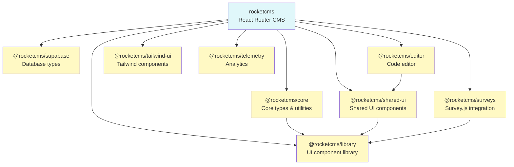
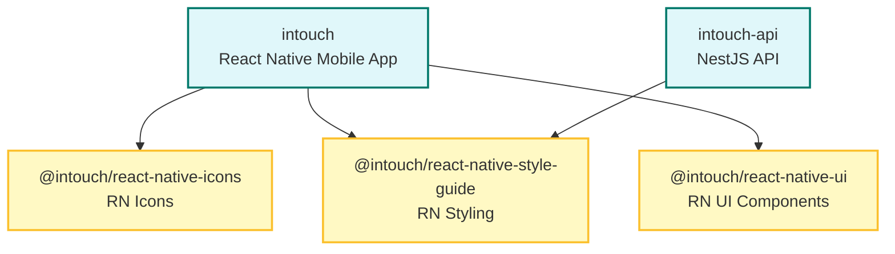
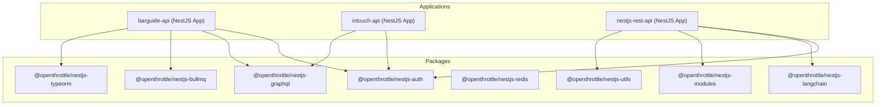
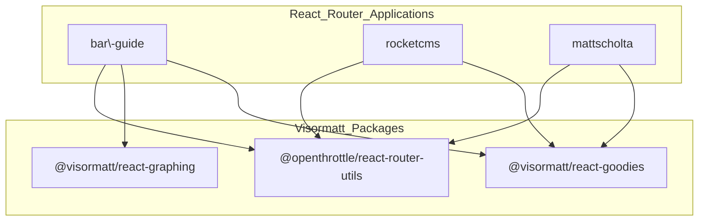
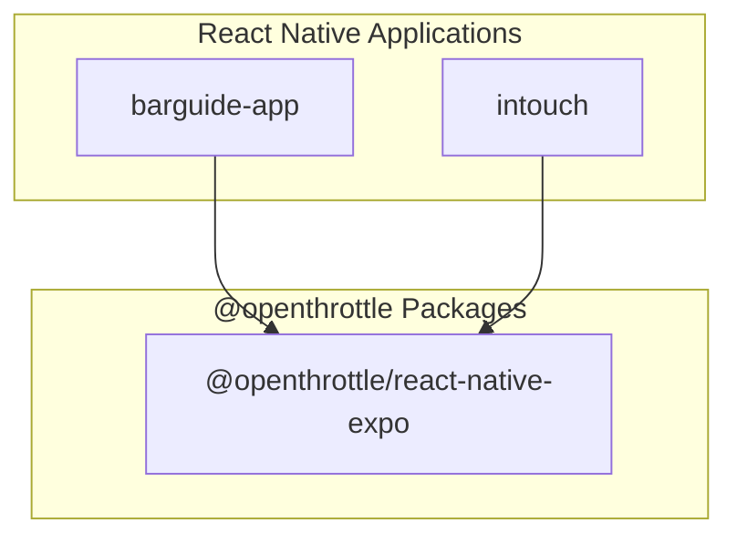
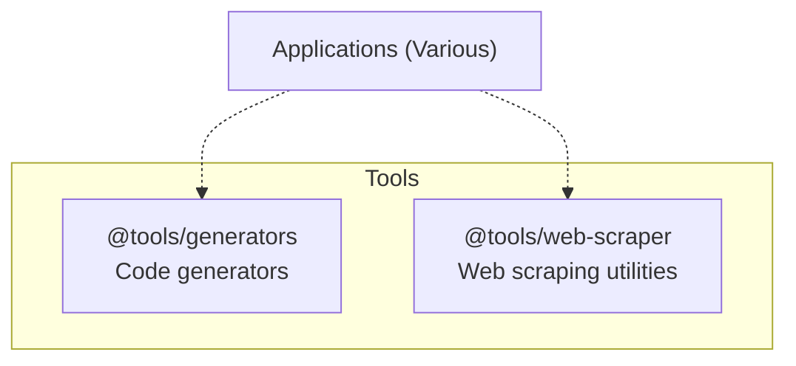

# Monorepo Dependency Relationships

## Overview

This document describes the key dependency relationships within the monorepo. Understanding these relationships is crucial for:

- Making informed decisions when adding new dependencies
- Identifying potential refactoring opportunities
- Understanding the impact of changes to shared packages
- Preventing circular dependencies

## Monorepo Structure

The monorepo contains **63 projects** organized into:

- **14 Applications**: Runnable projects (web apps, mobile apps, APIs)
- **49 Packages**: Shared libraries organized by domain
- **4 Tools**: Build tools and generators

### Domain Organization

Packages are organized by domain/scope:

- `@barguide/*`: 14 packages for BarGuide application
- `@rocketcms/*`: 7 packages for RocketCMS application
- `@intouch/*`: 3 packages for InTouch application
- `@openthrottle/*`: 12 packages (NestJS utilities, React Native, utilities)
- `@visormatt/*`: 5 packages (React utilities, testing)
- `@tools/*`: 4 packages (build tools, generators)

## Key Dependency Patterns

### 1. React Router Applications

**Applications**: `barguide`, `rocketcms`, `mattscholta`, `charlizescholta`, `jaxscholta`, `kellischolta`, `iron-sights`, `carlsbad-pipelines`

**Common Dependencies**:

- React Router packages (`@react-router/*`)
- Domain-specific packages (e.g., `@rocketcms/*` for RocketCMS apps)
- Shared utilities (`@openthrottle/react-router-utils`, `@visormatt/react-goodies`)

**Pattern**: These applications typically depend on domain-specific packages but not on each other.

### 2. React Native / Expo Applications

**Applications**: `barguide-app`, `intouch`

**Common Dependencies**:

- Expo SDK packages
- React Native packages
- Domain-specific React Native packages:
  - `@barguide/react-native-*` for BarGuide app
  - `@intouch/react-native-*` for InTouch app
- Shared React Native utilities (`@openthrottle/react-native-expo`)

**Pattern**: Mobile applications depend on domain-specific React Native packages and Expo.

### 3. NestJS API Applications

**Applications**: `barguide-api`, `intouch-api`, `nestjs-rest-api`

**Common Dependencies**:

- NestJS core packages (`@nestjs/*`)
- `@openthrottle/nestjs-*` utility packages:
  - `@openthrottle/nestjs-auth`: Authentication
  - `@openthrottle/nestjs-graphql`: GraphQL integration
  - `@openthrottle/nestjs-bullmq`: Queue management
  - `@openthrottle/nestjs-typeorm`: Database ORM
  - `@openthrottle/nestjs-redis`: Redis integration
  - `@openthrottle/nestjs-langchain`: LangChain integration
  - And more...

**Pattern**: API applications depend on NestJS utility packages from `@openthrottle/*` scope.

## Domain-Specific Dependency Relationships

### BarGuide Domain

```mermaid
flowchart TB
  %% BarGuide Applications
  BG["barguide<br/>React Router Web App"]
  BGAPP["barguide-app<br/>React Native Mobile App"]
  BGAPI["barguide-api<br/>NestJS API"]

  %% @barguide Packages
  BGCOMMON["@barguide/common<br/>Shared types & utilities"]
  BGICONS["@barguide/icons<br/>Icon components"]
  BGEMAILS["@barguide/react-emails<br/>Email templates"]
  BGHOOKS["@barguide/react-hooks<br/>React hooks"]
  BGRN["@barguide/react-native<br/>RN utilities"]
  BGRNUI["@barguide/react-native-ui<br/>RN UI components"]
  BGRNSTYLE["@barguide/react-native-style-guide<br/>RN styling"]
  BGRNSUPABASE["@barguide/react-native-supabase<br/>RN Supabase client"]
  BGRR["@barguide/react-router<br/>React Router utilities"]
  BGSUPABASE["@barguide/supabase<br/>Supabase types & client"]

  %% Relationships
  BG --> BGCOMMON
  BG --> BGICONS
  BG --> BGEMAILS
  BG --> BGHOOKS
  BG --> BGRR
  BG --> BGSUPABASE

  BGAPP --> BGRN
  BGAPP --> BGRNUI
  BGAPP --> BGRNSTYLE
  BGAPP --> BGRNSUPABASE

  BGAPI --> BGSUPABASE

  %% Logical grouping (not rendered as "subgraph" due to renderer issues)
  classDef app fill:#E0F7FA;
  classDef pkg fill:#FFF9C4;
  class BG,BGAPP,BGAPI app;
  class BGCOMMON,BGICONS,BGEMAILS,BGHOOKS,BGRN,BGRNUI,BGRNSTYLE,BGRNSUPABASE,BGRR,BGSUPABASE pkg;
```



**Key Relationships**:

- `barguide` (web app) depends on multiple `@barguide/*` packages
- `barguide-app` (mobile app) depends on React Native-specific `@barguide/react-native-*` packages
- `barguide-api` depends on `@barguide/supabase` for database types
- All BarGuide packages can depend on `@barguide/common` for shared types

### RocketCMS Domain



**Key Relationships**:

- `rocketcms` application depends on all `@rocketcms/*` packages
- `@rocketcms/core` is the foundation, providing types and utilities
- `@rocketcms/library` contains core UI components used by other packages
- `@rocketcms/shared-ui` builds on `@rocketcms/library` for complex components
- `@rocketcms/editor` depends on `@rocketcms/shared-ui` for UI components

### InTouch Domain



<!--
Tip: If mermaid rendering fails in some markdown viewers (especially with the <br/> tag), try using `\n` or simplifying node labels, e.g. 'intouch (React Native App)'.
-->

**Key Relationships**:

- `intouch` mobile app depends on all `@intouch/react-native-*` packages
- `intouch-api` may depend on shared types from `@intouch/react-native-style-guide`

### MattScholta Domain (Shared Utilities)



## NestJS Application to @openthrottle/nestjs-\* dependency graph

_Note: If Mermaid rendering fails, ensure your markdown preview or documentation site has Mermaid enabled. This chart uses Mermaid's 'flowchart' for best compatibility._

**Key Relationships**:

- NestJS applications depend on various `@openthrottle/nestjs-*` utility packages
- These packages are designed to be independent and composable
- Common dependencies: `@openthrottle/nestjs-auth`, `@openthrottle/nestjs-graphql`

## Cross-Domain Dependencies

### Shared React Utilities



**Key Relationships**:

- Multiple React Router applications share `@openthrottle/react-router-utils` for common utilities
- `@visormatt/react-graphing` provides charting components
- `@visormatt/react-goodies` provides utility hooks and components

### Shared React Native Utilities



**Key Relationships**:

- React Native applications may share `@openthrottle/react-native-expo` for Expo-specific utilities

## Tools and Build Infrastructure



**Key Relationships**:

- Tools are typically used during development/build time
- `@tools/generators` provides NX generators for creating new projects

## Dependency Rules and Best Practices

### 1. Domain Boundaries

- **Applications should primarily depend on packages within their domain**
  - `barguide` → `@barguide/*`
  - `rocketcms` → `@rocketcms/*`
  - `intouch` → `@intouch/*`

### 2. Shared Utilities

- **Cross-domain utilities should be in `@openthrottle/*` or `@visormatt/*`**
  - NestJS utilities → `@openthrottle/nestjs-*`
  - React utilities → `@visormatt/react-*`
  - React Native utilities → `@openthrottle/react-native-*`

### 3. Package Layering

- **Lower-level packages should not depend on higher-level packages**
  - `@rocketcms/core` should not depend on `@rocketcms/shared-ui`
  - `@barguide/common` should not depend on `@barguide/react-router`

### 4. Application Independence

- **Applications should not depend on other applications**
  - `barguide` should not import from `rocketcms`
  - Applications communicate through APIs or shared packages

### 5. Enforced module boundaries (ESLint)

These rules are enforced via `@nx/enforce-module-boundaries` (configured in `tools/dotfiles/src/index.ts`) using the existing tag strategy (`type:*`, `production:*`).

- **`type:application`**: may only depend on `type:package`
- **`type:package`**: may only depend on `type:package`
- **`type:tool`**: may only depend on `type:package` and `type:tool`
- **`production:true`**: must not depend on `production:false`

**Note**: `production:false` is not currently used by any NX projects, so the production-layering rule is effectively a no-op today (it’s intentionally forward-looking so we can tag non-production projects later without changing the rule).

**Example**

- Invalid (application importing from another application):

```ts
import { someHelper } from 'applications/rocketcms/app/someHelper';
```

- Fix: move the shared code into a package (`type:package`) and import from that package instead:

```ts
import { someHelper } from '@visormatt/react-goodies';
```

## Circular Dependency Status

✅ **No circular dependencies detected** in the current monorepo structure.

To verify this:

```bash
nx graph --focus=<project-name>
```

Look for loops in the visualization. If circular dependencies are introduced, NX will detect them during builds.

## Dependency Analysis Commands

### View Dependencies of a Project

```bash
# See what a project depends on
nx graph --focus=barguide

# See what depends on a package
nx graph --focus=@rocketcms/core
```

### Check for Circular Dependencies

```bash
# View full graph and look for loops
nx graph

# Generate JSON for programmatic analysis
nx graph --file=graph.json
```

### Analyze Affected Projects

```bash
# See what's affected by changes
nx graph --affected

# Compare specific commits
nx graph --base=main --head=HEAD --affected
```

## Known Dependency Patterns

### React Router Applications Pattern

Most React Router applications follow this pattern:

1. Import domain-specific packages
2. Import shared utilities (`@openthrottle/react-router-utils`)
3. Use React Router for routing
4. Depend on build-time packages (`^build`)

### React Native Applications Pattern

React Native applications follow this pattern:

1. Import Expo SDK packages
2. Import domain-specific React Native packages
3. Use shared React Native utilities
4. Depend on codegen tasks for type generation

### NestJS API Pattern

NestJS APIs follow this pattern:

1. Import NestJS core packages
2. Import `@openthrottle/nestjs-*` utility packages
3. Use domain-specific packages for types (e.g., `@barguide/supabase`)
4. Compose modules from utility packages

## Maintenance Guidelines

### When Adding a New Dependency

1. **Check domain boundaries**: Should this be in the same domain or shared?
2. **Verify no circular dependencies**: Use `nx graph` to check
3. **Consider package layering**: Lower-level packages shouldn't depend on higher-level ones
4. **Document the relationship**: Update this document if adding a significant new pattern

### When Refactoring

1. **Check dependents**: Use `nx graph --focus=<package>` to see what depends on it
2. **Verify build still works**: Run `nx affected --targets build`
3. **Update documentation**: Keep this document current with changes

## Scheduled Dependency Graph Visualizations

The monorepo automatically generates dependency graph visualizations on a weekly schedule (every Monday at 9:00 AM UTC). These visualizations help track dependency changes over time.

### Accessing Scheduled Graphs

**From Repository**:

- Latest: `docs/nx/dependency-graphs/dependency-graph-latest.html`
- Historical: `docs/nx/dependency-graphs/dependency-graph-YYYYMMDD.html`

**From GitHub Actions**:

1. Go to [Actions](https://github.com/visormatt/monorepo/actions)
2. Find "📊 Scheduled Dependency Graph Generation" workflow
3. Download the artifact from the latest run

For detailed instructions, see the [NX Graph Usage Guide](../nx-graph.md#scheduled-dependency-graph-visualizations).

## Related Documentation

- [NX Graph Usage Guide](../nx-graph.md) - How to use nx graph for visualization
- [Monorepo Structure](../monorepo/) - Overall monorepo organization
