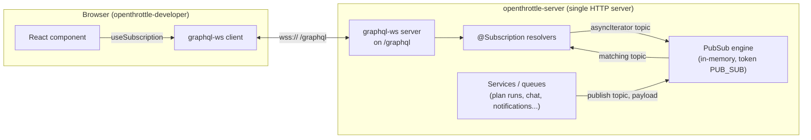
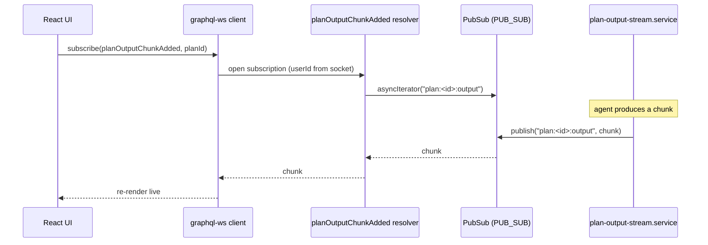

# Real-time: WebSockets & PubSub

How OpenThrottle delivers live updates (plan-run output, streaming chat,
notifications, log tails, transcription) to the browser.

**TL;DR:** GraphQL subscriptions over a single `graphql-ws` transport on the
`/graphql` endpoint, authed once at connect via a short-lived JWT, brokered
through an **in-memory** `PubSub` (`PUB_SUB` token) using
`<entity>:<id>:<facet>` topics. Single-process today; there's a documented
one-line swap to `RedisPubSub` when horizontal scaling is needed.

## The big picture

Subscribers and publishers never talk directly. They rendezvous on a **string
topic** through the PubSub engine: a resolver listens on
`asyncIterator("plan:123:output")`; elsewhere a service calls
`publish("plan:123:output", chunk)`. That decoupling is the point of PubSub.

## WebSocket transport

One WebSocket — the GraphQL subscription transport — sharing the HTTP server.
No separate port or path.

- Configured in
  [`packages/nestjs-graphql/src/modules/nestjs-graphql.module.ts:147`](../../packages/nestjs-graphql/src/modules/nestjs-graphql.module.ts)
  via the Apollo driver's `subscriptions: { 'graphql-ws': {...} }` block. No
  `path` set → defaults to `/graphql`.
- **Auth happens once at connection time.** On `connection_init` the client
  sends `{ authToken }` in `connectionParams`; the server verifies it as an
  HS256 JWT and stashes `userId` on the socket
  ([`graphql-ws-auth.ts`](../../packages/nestjs-graphql/src/subscriptions/graphql-ws-auth.ts)).
  Bad/missing token → socket closed `4403 Forbidden`. Resolvers then read
  identity from `context.userId`.

## PubSub

In-memory `PubSub` from `graphql-subscriptions` — **not** Redis-backed.

- [`packages/nestjs-graphql/src/pubsub/pubsub.module.ts`](../../packages/nestjs-graphql/src/pubsub/pubsub.module.ts)
  — a `@Global()` module providing `new PubSub()` under the injection token
  **`PUB_SUB`**.
- The file documents a "Redis seam": swap the factory body for `RedisPubSub`
  from `graphql-redis-subscriptions` to scale to multiple server instances.
  Both implement `PubSubEngine`, so no resolver changes. **Not wired today** —
  real-time currently assumes a single server process.

## Topics — the naming convention

All topic strings come from one file,
[`packages/nestjs-graphql/src/subscriptions/topics.ts`](../../packages/nestjs-graphql/src/subscriptions/topics.ts),
so publishers and subscribers can't drift (in-memory PubSub matches literal
strings — no wildcards):

- **Instance-scoped:** `<entity>:<id>:<facet>` → e.g. `plan:abc:output`,
  `conversation:xyz:stream`, `user:42:notifications`
- **Global-scoped:** `<entity>:<facet>` → e.g. `notifications:all`,
  `system:alert`

| Facet               | Topic                                           | Used by                   |
| ------------------- | ----------------------------------------------- | ------------------------- |
| Plan run output     | `plan:<id>:output`                              | Ralph/agent run streaming |
| Plan lifecycle      | `plan:<id>:lifecycle`                           | status changes            |
| Chat / token deltas | `conversation:<id>:stream`                      | streaming chat replies    |
| Voice               | `transcription:<id>:stream`                     | live transcription        |
| Notifications       | `user:<id>:notifications` + `notifications:all` | bell + firehose           |
| Queue logs          | `bullmq:<queue>:<jobId>:logs`                   | log tail                  |

## Example flow: streaming a plan run

- Resolver:
  [`plan-output-stream.resolver.ts:156`](../../applications/openthrottle-server/src/graphql/plan-output-stream/plan-output-stream.resolver.ts)
- Publisher:
  [`plan-output-stream.resolver.ts:111`](../../applications/openthrottle-server/src/graphql/plan-output-stream/plan-output-stream.resolver.ts)
- Notifications fan out to multiple topics in one call —
  [`notifications.service.ts:75`](../../applications/openthrottle-server/src/notifications/notifications.service.ts)
  publishes to the per-user topic, the firehose, and the plan-lifecycle topic.

## Client side

- Shared wrapper:
  [`packages/react-router-graphql/src/hooks/createGraphqlWsClient.tsx:45`](../../packages/react-router-graphql/src/hooks/createGraphqlWsClient.tsx)
  — SSR-safe (`null` on the server), uses the native browser `WebSocket`.
- URL/scheme selection in the developer app:
  [`graphql-ws-client.ts:22`](../../applications/openthrottle-developer/app/services/graphql-ws-client.ts)
  rewrites the API base — `http→ws`, `https→wss` — and appends `/graphql`.
- **Token handling:** `connectionParams` calls a same-origin route
  `/auth/ws-token` on every (re)connect to mint a fresh short-lived JWT. The
  HttpOnly auth cookie never leaves the app origin, and reconnects
  re-authenticate without a page reload. The token is minted server-side by
  [`subscription-token.resolver.ts`](../../applications/openthrottle-server/src/graphql/auth/subscription-token.resolver.ts).

## Two things that are NOT the GraphQL PubSub

Worth knowing so they don't cause confusion:

1. **Plan-cancel signal** —
   [`plan-cancel-channel.service.ts`](../../applications/openthrottle-server/src/queues/plans/plan-cancel-channel.service.ts)
   uses a _raw ioredis_ `publish`/`psubscribe` (the BullMQ connection), not the
   GraphQL PubSub. It's a cross-process control signal because plan workers may
   run in a different process than the API.
2. **Socket.IO** — fully removed from GraphQL transport, but survives as one
   optional `@WebSocketGateway` in
   [`packages/nestjs-logging`](../../packages/nestjs-logging/src/gateways/nestjs-logging-websocket.gateway.ts)
   for dev JSONL log streaming, wired only when dev logging is enabled
   ([`app.module.ts:201`](../../applications/openthrottle-server/src/app.module.ts)).
