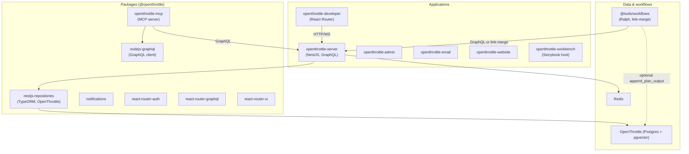
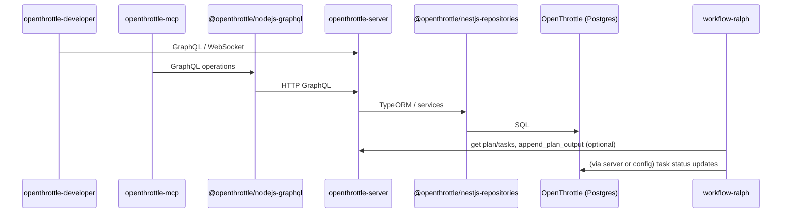

# OpenThrottle monorepo architecture

How the OpenThrottle applications and packages fit together — Mermaid diagrams plus short narratives. See also `applications/openthrottle/README.md` (the Docker Compose stack) and `databases/README.md` (the schema).

The two summary tables below are **not exhaustive**: `packages/` holds ~60 packages. `pnpm nx show projects` is the authoritative inventory; these tables name the ones you need to understand the request path.

## High-level architecture

OpenThrottle consists of **applications** (deployable apps) and **packages** (shared libraries). The backend is **openthrottle-server** (NestJS + GraphQL); it talks to **OpenThrottle** (Postgres with pgvector) via **@openthrottle/nestjs-repositories**. The **openthrottle-mcp** MCP and the **openthrottle-developer** UI both call the server’s GraphQL API; the MCP uses **@openthrottle/nodejs-graphql** as a typed GraphQL client. **Ralph** and other workflows in **@tools/workflows** drive the agentic loop and optionally stream output to OpenThrottle.

---

## Data and request flow

- **openthrottle-developer**: Browser app; calls `API_URL` (openthrottle-server) for GraphQL and optional WebSocket (e.g. realtime, notifications).
- **openthrottle-mcp**: MCP server used by Cursor/other hosts; uses `@openthrottle/nodejs-graphql` to talk to openthrottle-server GraphQL (plans, tasks, search, commit links, plan output stream, etc.). No direct Postgres access.
- **openthrottle-server**: NestJS app; GraphQL API, auth (JWT), queues (BullMQ/Redis), and **NestjsRepositoriesModule** (`@openthrottle/nestjs-repositories`) for OpenThrottle (plans, tasks, embeddings, commit_links, plan_output_stream, docs, users, RBAC). Optional OpenAI or Ollama for embeddings.
- **Ralph** (`workflow-ralph`): Loads plan/tasks from OpenThrottle (via server or env), runs the agent loop, updates task status from agent output; can append iteration output to OpenThrottle `plan_output_stream`. Commit linking is done only after PR merge via `workflow-link-merge`.

---

## Applications (summary)

| Application                | Role                                                                                                                                                               |
| -------------------------- | ------------------------------------------------------------------------------------------------------------------------------------------------------------------ |
| **openthrottle-server**    | NestJS GraphQL API; auth, plans, tasks, embeddings, commit links, docs, users, RBAC; BullMQ queues; talks to OpenThrottle via `@openthrottle/nestjs-repositories`. |
| **openthrottle-developer** | React Router UI for developers; plans, tasks, search, commit links; configurable `API_URL` to the server.                                                          |
| **openthrottle-admin**     | Admin portal.                                                                                                                                                      |
| **openthrottle-email**     | Email-related services.                                                                                                                                            |
| **openthrottle-website**   | Marketing website.                                                                                                                                                 |
| **openthrottle-workbench** | Storybook 10 host for `@openthrottle/react-router-shadcn` — component library, `cva` variants, themes. Not deployed with the product.                              |

`applications/openthrottle/` is not an app — it holds the Docker Compose stack and its Dockerfiles.

Shared infra used by the server: **Postgres** (OpenThrottle schema in `databases/`), **Redis** (BullMQ, sessions, etc.). Docker Compose for the core stack: the repo-root `docker-compose.yml` (run `docker compose up --build` from the monorepo root).

---

## Packages (summary)

| Package                                      | Role                                                                                                                                                                                        |
| -------------------------------------------- | ------------------------------------------------------------------------------------------------------------------------------------------------------------------------------------------- |
| **@openthrottle/openthrottle-mcp**           | MCP server exposing OT tools (plans, tasks, search, commit links, plan output, etc.); depends on `@openthrottle/nodejs-graphql` to call openthrottle-server.                                |
| **@openthrottle/nodejs-graphql**             | Typed GraphQL client for Node (used by openthrottle-mcp); no direct DB.                                                                                                                     |
| **@openthrottle/nestjs-repositories**        | TypeORM-based data access for OpenThrottle (plans, tasks, embeddings, commit_links, plan_output_stream, documentation, users, roles, etc.); used only by openthrottle-server.               |
| **@openthrottle/openthrottle-notifications** | Notifications (e.g. used by server/developer).                                                                                                                                              |
| **@openthrottle/react-router-\***            | Shared React Router libs (auth, GraphQL, UI, utils, editor, profiling, chat, …) for the developer and other OT UIs. Source-first — no `build` target; see [MONOREPO.md](../../MONOREPO.md). |
| **@openthrottle/openthrottle-drivers**       | Dep-free descriptors for each agent CLI (`claude`, `cursor-agent`, `gemini`, `antigravity`, …) — argv shapes and capabilities, no filesystem access.                                        |
| **@openthrottle/openthrottle-agentic-\***    | The agentic layer: `-ralph` (the loop + its codegen GraphQL documents), `-utils` (workspace paths, skill injection), `-workflow`.                                                           |

---

## Related docs

- **OpenThrottle schema and usage:** `databases/README.md`
- **Run locally (OSS/Ollama embeddings):** `docs/monorepo/Ollama.md` § Embeddings for OpenThrottle
- **Docker Compose stack:** `applications/openthrottle/README.md`
- **Ralph and workflows:** `tools/workflows/README.md`, `AGENTS.md`
- **MCP developer setup:** `packages/openthrottle-mcp/README.md`
