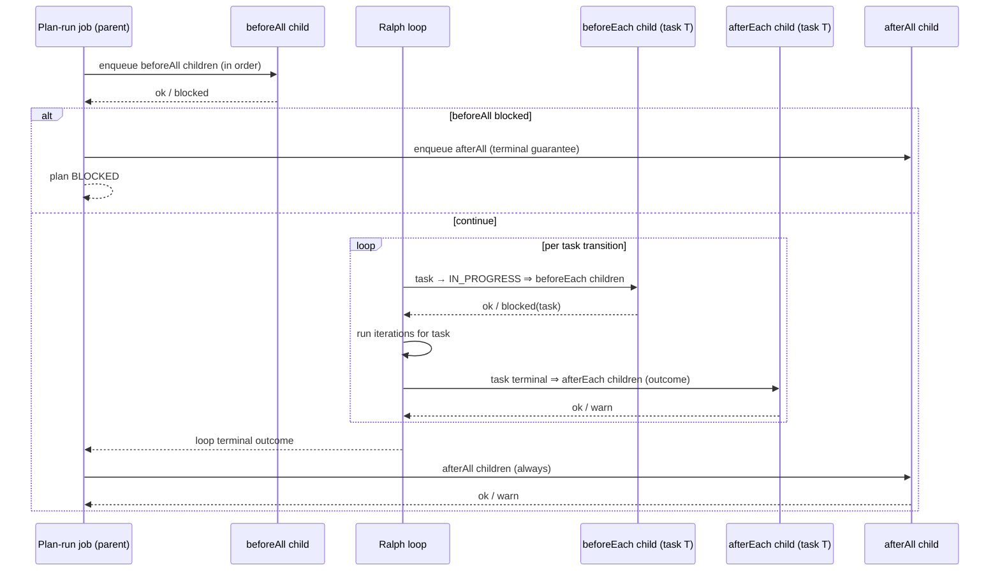
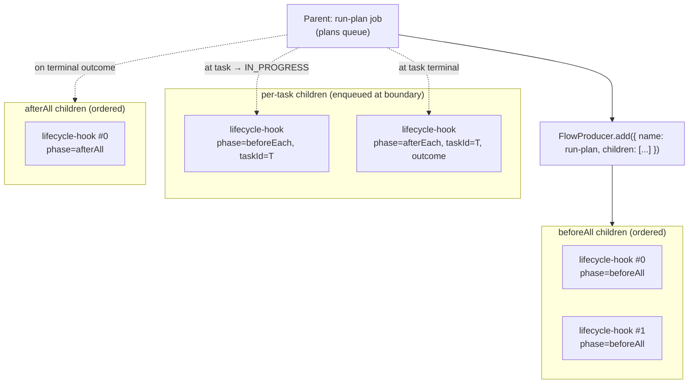

# Jest-style lifecycle hooks as BullMQ child jobs

> **Status:** Design (Phase 2 of plan `a1c55a0a-735c-4f60-965a-7f122acbdc8f`, task
> `c8896177-9b02-4c74-b890-7f7eff3327dd`). Evolves the existing run-level `before_run` / `after_run`
> hooks into a Jest-style lifecycle (`beforeAll` / `beforeEach` / `afterEach` / `afterAll`) scoped to
> the **plan and its tasks**, with each hook invocation executed as a **child BullMQ job** of the
> parent plan-run job.
>
> This document specifies the contract, scope, child-job model, per-task context, conditions,
> migration, and the transport-free boundary. Implementation lands downstream (see § Where each
> piece lives). For how Ralph runs today see
> [`ralph-execution-paths-and-package-layering.md`](./ralph-execution-paths-and-package-layering.md);
> for the current phase-1 hooks see [`../../JOB_RUN_LIFECYCLE_HOOKS.md`](../../JOB_RUN_LIFECYCLE_HOOKS.md).

## TL;DR

- **Four phases, modeled on Jest, scoped to plan + tasks** — not Ralph iterations:
  - `beforeAll` — once before the whole plan run (≈ today's `before_run`).
  - `beforeEach` — before **each task** (fires when a task transitions to `IN_PROGRESS`).
  - `afterEach` — after **each task** (fires when a task reaches a terminal status, with outcome).
  - `afterAll` — once after the whole plan run (≈ today's `after_run`).
- **Task boundaries, never iteration boundaries.** A task may span multiple Ralph iterations;
  `beforeEach` / `afterEach` fire on task transitions only.
- **Each hook invocation is a child BullMQ job** of the parent plan-run job (FlowProducer
  parent/child). This gives per-hook retries, timeouts, and observability, and keeps everything in
  BullMQ. The agent iteration itself stays the same single-iteration runner used today.
- **Per-task context** flows to `beforeEach` / `afterEach`: the specific task `(id, title, status)`
  plus plan context, and for `afterEach` the task outcome (`completed` / `failed` / `blocked`).
- **Back-compat:** stored `before_run` → `beforeAll`, `after_run` → `afterEach`/`afterAll` via wire
  parsing (same pattern as the existing draft `target` field). Migration 043 JSONB and the Developer
  UI are preserved.
- **Contract stays transport-free** in `@openthrottle/openthrottle-agentic-workflow`; GraphQL + Nest
  - BullMQ child-job wiring lives in `openthrottle-server` / `nestjs-agentic-workflow`.

## Phase model

| Phase        | Jest analog  | Scope    | Fires when                                                                     | Runs per plan run | Default `onFailure` |
| ------------ | ------------ | -------- | ------------------------------------------------------------------------------ | ----------------- | ------------------- |
| `beforeAll`  | `beforeAll`  | **Plan** | Once, after plan load + `IN_PROGRESS`, before the first iteration / first task | 1                 | `block`             |
| `beforeEach` | `beforeEach` | **Task** | Each time a task transitions to `IN_PROGRESS` (start of the task's first iter) | 0..N (per task)   | `block` (that task) |
| `afterEach`  | `afterEach`  | **Task** | Each time a task reaches a terminal status (`COMPLETED` / failed / `BLOCKED`)  | 0..N (per task)   | `warn`              |
| `afterAll`   | `afterAll`   | **Plan** | Once, on any terminal plan-run outcome (success, failure, blocked, cancelled)  | 1                 | `warn`              |

`beforeAll` / `afterAll` semantics are **identical** to today's `before_run` / `after_run` (run
once around the whole plan run). The new work is `beforeEach` / `afterEach` and the child-job
execution model.

### The "each" boundary is a task, not an iteration

The plan-centric Ralph loop (Surface #3 orchestrator,
`packages/openthrottle-agentic-ralph/src/utils/orchestrator.ts`) iterates up to `maxIterations`,
selecting a task per iteration. The mapping to hook boundaries:

| Orchestrator step (today)                                                               | Hook boundary                                |
| --------------------------------------------------------------------------------------- | -------------------------------------------- |
| `plan.mark_in_progress` (before the loop)                                               | `beforeAll` already ran before this          |
| Loop picks `taskForIteration`; status `PENDING`/`QUEUED` → `UpdateTask IN_PROGRESS`     | **`beforeEach` for that task** (first time)  |
| Same task continues across multiple iterations (still `IN_PROGRESS`, no new transition) | **No hook** (not an iteration boundary)      |
| `tasks.apply_completions` → `UpdateTask COMPLETED` (or failed/blocked)                  | **`afterEach` for that task** (with outcome) |
| `task.filter` finds `remaining.length === 0` → `UpdatePlan COMPLETED`                   | `afterAll` after the loop returns            |
| `max_iterations`: `lastIterationTaskId` reset to `PENDING` (NOT completed)              | **No `afterEach`** (task did not terminate)  |

Key invariant: **a task fires `beforeEach` at most once per plan run** (on its first
`→ IN_PROGRESS` transition) and `afterEach` at most once (on its terminal transition). Tasks reset
to `PENDING` on `max_iterations` did **not** terminate, so they get **no** `afterEach` for that run;
on a subsequent re-run they fire `beforeEach` again.



## Contract (transport-free) — `@openthrottle/openthrottle-agentic-workflow`

The phase enum and entry shapes move to the shared contract package so both the GraphQL orchestrator
(Surface #3) and any downstream wiring share one definition. Today the canonical types live in
`@tools/workflows` (`tools/workflows/src/types/job-run-lifecycle-hooks.ts`); Phase 2 promotes the
**phase + entry contract** into `openthrottle-agentic-workflow` (the dependency sink) and leaves
resolution/validation helpers where consumers need them.

### Phase enum

```ts
/** @description Jest-style lifecycle phases, scoped to plan (All) and tasks (Each). */
export type WorkflowLifecyclePhase =
  | 'afterAll'
  | 'afterEach'
  | 'beforeAll'
  | 'beforeEach';

/** @description Plan-scoped phases run once per plan run. */
export type WorkflowPlanLifecyclePhase = 'afterAll' | 'beforeAll';

/** @description Task-scoped phases run per task transition. */
export type WorkflowTaskLifecyclePhase = 'afterEach' | 'beforeEach';
```

### Entry shape (extends today's discriminated union)

The `kind` (`prompt_profile` named/file, `skill`), `onFailure`, `order`, `timeoutSeconds`, and
delivery fields are **unchanged** from phase 1. Only `phase` widens and `conditions` gains
task-scoped filters.

```ts
export interface WorkflowLifecycleHookConditions {
  /** Existing: spawn vs orchestrator job path. Omit = both. */
  readonly runKinds?: ReadonlyArray<'orchestrator' | 'spawn'>;
  /** `afterAll` only (parity with whenMainRunSucceeded). Omit = any terminal. */
  readonly whenPlanRunSucceeded?: boolean;
  /** `afterEach` only. Omit = any task terminal outcome. */
  readonly whenTaskOutcome?: ReadonlyArray<'blocked' | 'completed' | 'failed'>;
  /** `beforeEach` / `afterEach` only. Restrict by task category (e.g. 'infra'). */
  readonly taskCategories?: ReadonlyArray<string>;
  /** `beforeEach` / `afterEach` only. Restrict by entry task status. */
  readonly taskStatuses?: ReadonlyArray<string>;
}
```

### Hooks are part of the execution contract

`WorkflowExecutionHooks` (in `packages/openthrottle-agentic-workflow/src/types.ts`) is the natural
home for an **optional lifecycle dispatcher** the orchestrator calls at boundaries, keeping the
orchestrator transport-free (it does not know about BullMQ or GraphQL):

```ts
export interface WorkflowLifecycleDispatcher {
  /** Run plan-scoped children for a phase; resolves to whether the phase blocked. */
  readonly runPlan: (params: {
    readonly phase: WorkflowPlanLifecyclePhase;
    readonly planRunSucceeded?: boolean;
  }) => Promise<{ readonly blocked: boolean }>;
  /** Run task-scoped children for a phase; resolves to whether the phase blocked that task. */
  readonly runTask: (params: {
    readonly phase: WorkflowTaskLifecyclePhase;
    readonly task: WorkflowLifecycleTaskContext;
    readonly taskOutcome?: 'blocked' | 'completed' | 'failed';
  }) => Promise<{ readonly blocked: boolean }>;
}

export interface WorkflowLifecycleTaskContext {
  readonly category: string | undefined;
  readonly id: string;
  readonly status: string;
  readonly title: string;
}
```

The orchestrator calls `dispatcher.runTask({ phase: 'beforeEach', task })` right after it sets a
task `IN_PROGRESS`, and `dispatcher.runTask({ phase: 'afterEach', task, taskOutcome })` right after a
terminal task transition. When no dispatcher is provided (e.g. Local CLI surface), the calls are
no-ops — preserving parity for surfaces that do not yet support child-job hooks.

## Child BullMQ job model

Each hook invocation runs as a **child job** of the parent plan-run job, using BullMQ
`FlowProducer` for parent/child relationships. The agent iteration inside a child is the same single
iteration (`createCursorWorkflowRalphIterationRunner` → `runIterationAsync`) used today; only the
_host_ changes from "in-process inside the worker" to "a dedicated child job".

### Why child jobs

- **Per-hook retries / timeouts** independent of the parent run.
- **Observability**: each hook is a queryable BullMQ job with its own state, logs, and metrics.
- **Isolation**: a slow or failing hook does not occupy the parent worker's single slot for its full
  duration; the parent awaits child completion via the flow.
- **Uniform model**: plan-run + every hook are all BullMQ jobs (aligns with the Phase 2 "everything
  through GraphQL + BullMQ" target).

### Queue and job naming

| Job                        | Queue                        | `name`                       | Data discriminant                       |
| -------------------------- | ---------------------------- | ---------------------------- | --------------------------------------- |
| Parent plan run (existing) | `plans` (`WORKFLOW_NAME`)    | `run-plan` / `Agentic Ralph` | `runKind: 'spawn' \| 'orchestrator'`    |
| Lifecycle hook child       | `plan-lifecycle-hooks` (new) | `lifecycle-hook`             | `{ phase, hookIndex, planId, taskId? }` |

A dedicated child queue keeps hook concurrency, rate limits, and retention independent of the plan
worker's `limiter` (which today forces one plan job at a time).

### Parent/child data flow



Two complementary mechanisms (used together):

1. **Static phases known up-front** (`beforeAll`, `afterAll`): modeled as FlowProducer **children of
   the parent** so BullMQ enforces "children complete → parent proceeds" for `beforeAll`, and the
   parent's `afterAll` children are added as a finalizing flow.
2. **Dynamic per-task phases** (`beforeEach`, `afterEach`): the count is not known until the loop
   selects tasks. These are **enqueued explicitly at the boundary** as children of the parent
   (`FlowProducer.add` with `opts.parent = { id, queue }`) and **awaited** before the loop continues
   (for `beforeEach`) or before the next task starts (for `afterEach`).

The dispatcher (above) is the in-worker object that performs the enqueue-and-await; the orchestrator
stays transport-free and only calls `runTask` / `runPlan`.

### Ordering guarantees

- Within a phase, children run in **configured order** (`order`, then stable index) — same
  `sortJobRunHookEntries` comparator, extended to the four phases.
- Children of a single phase run **serially** (await child N before enqueuing child N+1) so
  `onFailure: block` can halt the remainder of the phase, matching today's `executeJobRunHooksPhase`
  loop semantics.
- Across phases: `beforeAll` → (`beforeEach` task → iterations → `afterEach` task)\* → `afterAll`.

### Blocking semantics

| Phase        | A child fails with `onFailure: block` ⇒                                                                                                                                                                                    |
| ------------ | -------------------------------------------------------------------------------------------------------------------------------------------------------------------------------------------------------------------------- |
| `beforeAll`  | **Halt the whole plan run.** Do not start the loop. Plan → `BLOCKED`. `afterAll` still runs (guarantee).                                                                                                                   |
| `beforeEach` | **Halt that task only.** Skip its iterations; mark the task `BLOCKED`; run its `afterEach` with outcome `blocked`; continue to the next task. (Configurable: a stricter mode could halt the plan — default is task-local.) |
| `afterEach`  | Default `warn`: record failure, keep task outcome, continue. `block` is recorded but does not retro-fail a completed task (it can gate the next task if `failNextOnAfterEachBlock` is set — deferred).                     |
| `afterAll`   | Default `warn`: record failure; plan status reflects the main run, not the hook.                                                                                                                                           |

### Terminal-outcome guarantees (afterEach / afterAll always run)

`afterAll` must run on **every** terminal path — success, failure, `beforeAll`-block, loop failure,
ensure-commit failure, and **cancellation**. Today this is centralized in
`completePlanRunWithHooks` / `runAfterRunHooksThenNotify`, called on all terminal branches of
`WorkflowProcessor`. Phase 2 keeps that single funnel and routes it through the child-job dispatcher.

- **Cancellation:** when the parent `abortSignal` fires, the loop stops, but the parent still
  enqueues `afterAll` children. `afterEach` for an in-flight task runs only if the task already
  reached a terminal status before cancel; an interrupted (still `IN_PROGRESS`) task gets no
  `afterEach` (it did not terminate), matching the `max_iterations` PENDING-reset rule.
- **Worker death / stall:** `afterAll` children are part of the flow; on restart, BullMQ
  stalled-job recovery re-runs the parent, which re-funnels through the terminal path. Children are
  idempotent by `(planId, phase, hookIndex, taskId?)` so re-runs do not double-execute side effects
  the agent already committed (best-effort; agents are expected to be idempotent like the main loop).

## Per-task context

`beforeEach` / `afterEach` children receive structured task context appended to the agent prompt
(reusing `buildJobRunHookAgentPrompt`, extended with a task block), so a prompt/skill can target the
specific task:

| Field           | beforeEach | afterEach | Source                                            |
| --------------- | ---------- | --------- | ------------------------------------------------- |
| `task.id`       | ✓          | ✓         | orchestrator `taskForIteration.id`                |
| `task.title`    | ✓          | ✓         | task row                                          |
| `task.status`   | ✓          | ✓         | status at the boundary (`IN_PROGRESS` / terminal) |
| `task.category` | ✓          | ✓         | task row (for `taskCategories` condition)         |
| `taskOutcome`   | —          | ✓         | `completed` / `failed` / `blocked`                |
| plan context    | ✓          | ✓         | `formatPlanAndTasksForPrompt(plan, tasks)`        |

Plan-scoped phases (`beforeAll` / `afterAll`) receive plan context only (no single task), as today.

## Conditions (extended)

Existing: `runKinds`, `whenMainRunSucceeded` (renamed to `whenPlanRunSucceeded` for `afterAll`,
legacy name parsed for back-compat). New task-scoped filters apply only to `beforeEach`/`afterEach`:

- `whenTaskOutcome?: ('completed' | 'failed' | 'blocked')[]` — `afterEach` only.
- `taskCategories?: string[]` — match the task's category.
- `taskStatuses?: string[]` — match the task's status at the boundary.

`shouldRunJobRunHook` is extended to evaluate these against the new context object
`{ phase, runKind, planRunSucceeded?, task?, taskOutcome? }`.

## Migration / back-compat

### Phase enum: add the two new phases; alias the old ones

Follow the **existing wire/legacy parsing pattern** (the draft `target` field that
`parseJobRunHookEntry` already accepts). On read/parse:

| Stored / wire value                                   | Parsed phase |
| ----------------------------------------------------- | ------------ |
| `before_run`                                          | `beforeAll`  |
| `after_run`                                           | `afterAll`   |
| `beforeAll` / `beforeEach` / `afterEach` / `afterAll` | as-is        |

Rationale for `before_run → beforeAll` and `after_run → afterAll`: today's hooks wrap the **whole
run** once, which is exactly the `*All` semantics. Existing plans keep identical behavior after
migration. No stored data needs rewriting — parsing maps legacy values on the fly.

### Persistence (migration 043 preserved)

- Keep `plans.job_run_hooks` JSONB (`{ hooks: [...] }`); no schema change required — the `phase`
  string widens within the same JSON shape.
- Update the column `COMMENT` to mention the four phases.
- Optional follow-up migration: none needed for storage; a data migration could rewrite
  `before_run`/`after_run` to `beforeAll`/`afterAll` later, but is **not** required because parsing
  handles legacy values (same approach as `target`).

### GraphQL / enqueue (unchanged shape)

- `PlanObject.jobRunHooksJson`, `UpdatePlanInput.jobRunHooksJson`,
  `EnqueuePlanRunInput.jobRunHooksJson`, `EnqueuePlanRalphOrchestratorInput.jobRunHooksJson` keep the
  same JSON contract; only the allowed `phase` values grow.
- `requireTargetsExist` validation (file prompts / skills) is unchanged.

### Developer UI (preserved, extended)

- `PlanWorkflowConfigHooks` keeps the ordered list; the **phase** select gains
  `beforeAll` / `beforeEach` / `afterEach` / `afterAll`.
- For `beforeEach` / `afterEach`, surface the new task-scoped condition fields (categories,
  statuses, `afterEach` outcome filter).
- Existing saved hooks render as `beforeAll` / `afterAll` (mapped from `before_run` / `after_run`)
  with no user action required.

## Where each piece lives

| Concern                                                     | Package / location                                                                     |
| ----------------------------------------------------------- | -------------------------------------------------------------------------------------- |
| Phase enum + entry contract + conditions (transport-free)   | `@openthrottle/openthrottle-agentic-workflow` (`src/types.ts`)                         |
| Lifecycle dispatcher interface (called by orchestrator)     | `@openthrottle/openthrottle-agentic-workflow`                                          |
| Validation / resolution / prompt-building helpers           | `@tools/workflows` today → migrate alongside contract in Phase 2                       |
| Orchestrator boundary calls (`runTask` at task transitions) | `@openthrottle/openthrottle-agentic-ralph` (`utils/orchestrator.ts`)                   |
| Child-job FlowProducer + dispatcher implementation          | `openthrottle-server` queues (`plan-lifecycle-hooks` queue + processor)                |
| Nest DI tokens for the dispatcher / child queue             | `@openthrottle/nestjs-agentic-workflow`                                                |
| Terminal funnel (`afterAll` always runs)                    | `WorkflowProcessor.completePlanRunWithHooks` (existing single funnel)                  |
| Persistence + GraphQL + UI                                  | migration 043 (unchanged), `PlanObject` / `UpdatePlanInput`, `PlanWorkflowConfigHooks` |

## Alignment with the broader plan

- **GraphQL-only transport** (task `f4bf218a`): child-job dispatcher reads/writes plan + task state
  and plan output via GraphQL; the single health check exception is unchanged.
- **`@tools/workflows` → `nestjs-agentic-workflow` migration** (task `978a661f`): promoting the hook
  contract into `openthrottle-agentic-workflow` and the dispatcher into the Nest layer is a step in
  that cutover. The orchestrator stays transport-free; BullMQ/GraphQL wiring is downstream.
- **before/after intent** (parent plan): `before*` hooks resolve which skill/prompts/sub-workflows
  apply; `after*` hooks enforce required checks (CI, code review, perf audit, monitor creation).
  `beforeAll` = pre-mortem/preflight; `afterEach` = per-task CI; `afterAll` = require CI + code
  review + integration (see multi-project design, task `2bdf0145`).

## Open questions

- [ ] `beforeEach` block default: task-local (skip that task, recommended) vs plan-halt — make it a
      per-hook option (`onFailure: 'block'` + `blockScope: 'task' | 'plan'`)?
- [ ] Should `afterEach` be allowed to **re-open** a completed task (e.g. CI failed) by setting it
      back to `IN_PROGRESS`/`BLOCKED`, or only record + notify? (Default: record + notify; reopening
      is a separate product decision.)
- [ ] Spawn surface (#2) runs the child `workflow-ralph` process, which owns its own loop — task
      boundaries are inside the child. To get `beforeEach`/`afterEach` on the spawn path we either
      (a) emit boundary events from the child back to the worker, or (b) make orchestrator the
      default (task `978a661f` already plans this). Recommendation: deliver `beforeEach`/`afterEach`
      on the **orchestrator** surface first; spawn keeps `beforeAll`/`afterAll` until it is folded
      under the orchestrator.
- [ ] Child-job concurrency for hooks vs the parent's single-job limiter — separate queue (proposed)
      with its own concurrency.

## Cross-links

- Current phase-1 hooks: [`../../JOB_RUN_LIFECYCLE_HOOKS.md`](../../JOB_RUN_LIFECYCLE_HOOKS.md)
- Execution surfaces + package layering:
  [`ralph-execution-paths-and-package-layering.md`](./ralph-execution-paths-and-package-layering.md)
- Worktree + BullMQ processor: [`bullmq-processor-worktree.md`](./bullmq-processor-worktree.md)
- Canonical decision table + target architecture: `tools/workflows/README.md`
- Parent plan: `a1c55a0a-735c-4f60-965a-7f122acbdc8f`; this task: `c8896177-9b02-4c74-b890-7f7eff3327dd`
