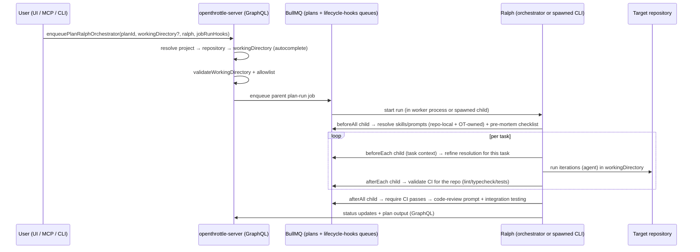
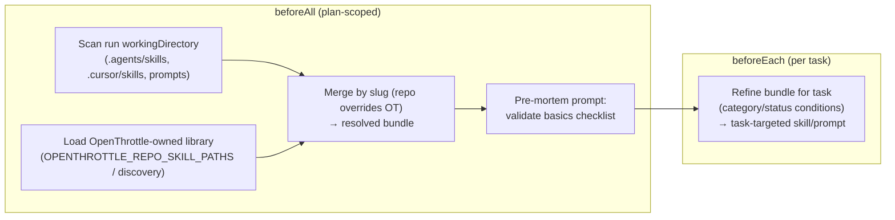

# Multi-project / cross-org abstraction with OpenThrottle-owned prompts and skills

> **Status:** Design (Phase 2 of plan `a1c55a0a-735c-4f60-965a-7f122acbdc8f`, task
> `2bdf0145-3b5e-46ae-923a-06bc927a95d6`). Specifies how **one** OpenThrottle installation runs
> agentic workflows alongside, around, and across **many** repositories (work + personal) while the
> Prompts, Skills, Generators, and customizable workflows live **primarily in OpenThrottle** so they
> are easy to share across a large org.
>
> The design must support **both** execution surfaces eventually: the **spawn** path (nested
> `workflow-ralph` in the worker) and the **in-process GraphQL orchestrator** path. It builds on the
> existing `workingDirectory` multi-workspace support and resolves OpenThrottle-owned customization
> per project via the `beforeAll` / `before*` lifecycle hooks.

## TL;DR

- **Identity model:** one install owns plans/tasks/projects in OT Postgres; **projects** map to
  **repositories**. A run targets a `(plan, project → repository, workingDirectory)` triple. The
  trust boundary is GraphQL + the `OPENTHROTTLE_ALLOWED_WORKING_DIRS` allowlist.
- **Reuse what exists:** `projects`, `workspace_local_repositories` (`project_id` link),
  `EnqueuePlanRun*.workingDirectory`, `validateWorkingDirectory` +
  `validateWorkingDirectory`, and `resolveForeignWorkspaceContext` already provide
  most of the multi-workspace plumbing. This design composes them; it does **not** invent a new
  multi-tenant entity.
- **Resolution via hooks:** which Skills/Prompts/Generators/sub-workflows apply to a run is resolved
  by the **`beforeAll`** hook (plan-scoped), with per-task refinement in **`beforeEach`**. The
  resolver merges **repo-local** customization (discovered in the target repo) with
  **OpenThrottle-owned** customization (the shared library), with a documented precedence.
- **Future-state lifecycle:** `beforeAll` = pre-mortem/preflight checklist; `afterEach` = per-task CI
  validation for the repo being worked on; `afterAll` = require CI passes → customized code-review
  prompt + integration testing. These are the concrete uses of the Jest-style hooks
  (task `c8896177`).
- **Both surfaces:** the resolution + hook model is defined on the **transport-free contract** so the
  orchestrator (Surface #3) implements it first; the spawn path (Surface #2) consumes the same
  resolved bundle via injected child env until it is folded under the orchestrator
  (task `978a661f`).

## Mental model: one install, many projects

```mermaid
flowchart TB
  subgraph ot["One OpenThrottle install"]
    pg[("OT Postgres\nplans · tasks · projects\nworkspace_local_repositories\njob_run_hooks")]
    gql["openthrottle-server (GraphQL)"]
    redis[("Redis / BullMQ")]
    app["openthrottle-developer (React Router)"]
    lib["OpenThrottle-owned library\nSkills · Prompts · Generators · Workflows"]
    gql --> pg
    gql --> redis
    app --> gql
    lib -. shipped with install .- gql
  end

  subgraph repos["Target repositories (work + personal)"]
    workRepo["/work/acme-monorepo\n(nx.json)"]
    personalRepo["/personal/side-project\n(nx.json)"]
    foreignRepo["/work/legacy-service\n(non-OpenThrottle)"]
  end

  gql -. enqueue plan run\n(project → workingDirectory) .-> workRepo
  gql -. enqueue plan run .-> personalRepo
  gql -. enqueue plan run .-> foreignRepo

  workRepo -. repo-local skills/prompts\n(.agents/skills, .cursor/skills) .-> gql
  personalRepo -. repo-local .-> gql
```

Key properties:

- **Customization lives primarily in OpenThrottle.** Skills/Prompts/Generators/workflows are owned by
  the install (the `lib` node) so an org shares one library. A repo **may** add or override
  repo-local skills/prompts, but the default source of truth is OpenThrottle.
- **Projects are the join.** A Cortex `project` is the stable handle a plan carries; it resolves to a
  repository (filesystem path) for the run. One install serves many projects across many repos.
- **The network boundary is GraphQL.** The server is the only thing that touches OT Postgres; runs
  talk to it over GraphQL (the single health-check exception aside). This is what lets one install
  safely serve work + personal projects with per-project identity/scoping
  (see [`graphql-only-transport-boundary.md`](./graphql-only-transport-boundary.md)).

## Future-state flow (target)

### 1. Install

User downloads/installs OpenThrottle (Postgres, Redis, NestJS + GraphQL, React Router app) **bundled
with** a set of Skills, Prompts, Generators, and customizable workflows. This bundled set is the
**OpenThrottle-owned library** — the shared, org-wide source of customization.

### 2. Register a project → repository

User registers a **project** and assigns it to one or many OT projects/repositories:

- A Cortex `project` already exists (`projects` table, `Project` GraphQL type).
- A **local repository** is registered via `createWorkspaceLocalRepository` (table
  `workspace_local_repositories`) and linked to the project via `project_id`
  (`setWorkspaceLocalRepositoryProject`). See
  [`workspace-settings-graphql-design.md`](../../applications/openthrottle-server/docs/workspace-settings-graphql-design.md).
- The repo row carries the **canonical absolute `filesystem_path`** (server-normalized,
  `validateWorkingDirectory` rules) plus optional git remote/branch. v1 is one project per repo;
  many-projects-per-repo is a deferred join table.

### 3. Configure the MCP globally and carve out plans

User sets up the OT MCP (`openthrottle-mcp`) globally and starts creating plans in OT. A plan may be
assigned a `project`; that linkage is what later lets us **autocomplete the working directory**.

### 4. Run a plan



Within the run:

- **Autocomplete working directory.** Given a plan with a `project`, the server resolves the linked
  `workspace_local_repositories.filesystem_path` and uses it as the run's `workingDirectory` when the
  caller omits one. Explicit `workingDirectory` always wins (and is validated identically).
- **Scan the target repository** for available Skills/Prompts (repo-local) vs sourced from
  OpenThrottle (overridable per project). This is the resolution step (below).
- **Configure the run:** worktree, working directory, custom model, iteration count — all already
  expressed through `RalphPlanRunTuningInput` / `EnqueuePlanRun*` and the persisted plan run config.
- **Lifecycle hooks** apply the OpenThrottle-owned customization and enforce checks (next section).

## Project / repository selection for a run

| Input source                | Field                                                            | Behavior                                                                                                                                            |
| --------------------------- | ---------------------------------------------------------------- | --------------------------------------------------------------------------------------------------------------------------------------------------- |
| Explicit `workingDirectory` | `EnqueuePlanRun*.workingDirectory`                               | Authoritative. Validated + allowlist-checked. Bypasses autocomplete. Non-Nx repos are allowed; the beforeAll pre-mortem hook validates runnability. |
| Plan's `project`            | `Plan.projectId` → `workspace_local_repositories.project_id`     | Autocomplete: resolve the linked repo's `filesystem_path` as `workingDirectory` when none provided.                                                 |
| Repo registration           | `workspace_local_repositories` (`filesystem_path`, git metadata) | The canonical local path + remote for a project. One install can register many.                                                                     |
| Allowlist                   | `OPENTHROTTLE_ALLOWED_WORKING_DIRS`                              | Trust boundary: server only runs in directories under an allowed prefix (when set).                                                                 |
| Repo runnability            | `beforeAll` lifecycle hook (Stage d)                             | Pre-mortem validates build/deps/git/allowlist for the target repo; replaces the removed Nx-root assertion.                                          |

**Resolution algorithm (server, at enqueue):**

1. If the caller passed `workingDirectory` → validate + assert + allowlist; use it.
2. Else if the plan has a `projectId` with a linked `workspace_local_repositories` row → use that
   row's `filesystem_path` (validate + assert + allowlist).
3. Else (no project link, no explicit dir) → run in the worker's default cwd (the OpenThrottle
   monorepo) **only if** the allowlist permits it; otherwise fail loudly with an actionable error
   telling the user to link a repository or pass `workingDirectory`.

This keeps the **server** as the single place that decides where a run executes, consistent with the
GraphQL-only boundary.

## OpenThrottle-owned vs repo-local customization

Two sources of Skills/Prompts/Generators/workflows, merged per run:

| Source           | Where it lives                                                                 | Discovery                                                                                                                        | Role                                                                 |
| ---------------- | ------------------------------------------------------------------------------ | -------------------------------------------------------------------------------------------------------------------------------- | -------------------------------------------------------------------- |
| **OpenThrottle** | Bundled with the install (the shared library); referenced by OT-stored hooks   | `OPENTHROTTLE_REPO_SKILL_PATHS` / repo-skills discovery against the OpenThrottle root (`getOpenThrottleRoot` / `WORKSPACE_ROOT`) | **Default / org-wide.** Source of truth; shared across all projects. |
| **Repo-local**   | The target repository (`.agents/skills/**`, `.cursor/skills/**`, prompt files) | `discover-repo-skills.server.ts` scanner run against the **run's `workingDirectory`** (not the OpenThrottle root)                | **Per-project override / addition.** Optional; overrides by slug.    |

**Precedence (decided):** repo-local entries **override** OpenThrottle-owned entries with the same
slug; OpenThrottle-owned entries fill the rest. This lets a project specialize a skill/prompt while
inheriting everything else from the shared library. A run config flag
(`customizationSource: 'openthrottle' | 'repo' | 'merge'`, default `merge`) can pin a project to
OpenThrottle-only (ignore repo-local) or repo-only (air-gapped) when an org needs stricter control.

**Why OpenThrottle-primary:** the parent plan's goal is that prompts/skills/generators live primarily
in OpenThrottle so they are easy to share across a large org. Repo-local discovery already exists
(the Skills page scanner); this design **re-points the scanner at the run's working directory** and
layers it under the OpenThrottle library rather than treating the OpenThrottle monorepo as the only
source.

## Resolution via the `before*` hooks

Resolution is a **`beforeAll`** responsibility (plan-scoped, runs once before the loop), with
per-task refinement in **`beforeEach`**. This reuses the Jest-style lifecycle hooks
(task `c8896177`) rather than adding a parallel mechanism.



- **`beforeAll`** resolves which skills/prompts/sub-workflows apply (merged bundle) **and** runs a
  pre-mortem prompt that validates a checklist of basics before iterating (e.g. repo builds, deps
  installed, git clean, allowlist OK). `onFailure: block` halts the whole plan run (the bundle/
  pre-mortem are preconditions).
- **`beforeEach`** refines the resolved bundle for the specific task using the task-scoped conditions
  already in the hook contract (`taskCategories`, `taskStatuses`) so, e.g., an `infra` task pulls a
  different skill than a `docs` task. Receives `WorkflowLifecycleTaskContext` (id, title, status,
  category).

The resolved bundle is exposed to the agent through the hook prompt-building path (the
OpenThrottle-owned skill/prompt content is injected the same way job-run hook prompts are today),
keeping the orchestrator transport-free.

## Enforcement via the `after*` hooks (required checks)

| Phase       | Scope | Future-state use                                                                                            | Default `onFailure`  |
| ----------- | ----- | ----------------------------------------------------------------------------------------------------------- | -------------------- |
| `beforeAll` | Plan  | Pre-mortem: validate a checklist of basics before iterating (build/deps/git/allowlist) + resolve the bundle | `block`              |
| `afterEach` | Task  | Run a skill that validates **CI for the repo being worked on** (lint, typecheck, tests; repo-dependent)     | `warn` (gate option) |
| `afterAll`  | Plan  | **Require CI passes**, then run a **customized code-review prompt** plus **integration testing**            | `warn` (block opt.)  |

- **`afterEach` (per-task CI):** the skill is repo-dependent — it runs the target repo's own
  lint/typecheck/test commands (resolved from the merged bundle / repo conventions), not OpenThrottle
  commands. On a foreign repo this is exactly why the foreign-workspace prompt layer exists (don't
  assume OpenThrottle tooling). Failure can either `warn` + record, or gate the next task via the
  hook's `block`/`blockScope` option (task `c8896177` open question).
- **`afterAll` (require CI + review + integration):** runs once on terminal plan outcome. It enforces
  the required checks: CI green, a customized code-review prompt (OpenThrottle-owned, possibly
  per-project), and integration testing. These are the org-wide gates that live in OpenThrottle and
  apply across projects.

These map 1:1 onto the hook phases already designed; this doc supplies the **multi-project intent**
for each phase.

## Supporting both execution surfaces

The design must work for both the spawn path and the in-process orchestrator path. The split:

| Concern                             | Surface #2 (spawn, nested `workflow-ralph`)                                                             | Surface #3 (in-process GraphQL orchestrator)                                                   |
| ----------------------------------- | ------------------------------------------------------------------------------------------------------- | ---------------------------------------------------------------------------------------------- |
| **Working-directory resolution**    | Resolved at enqueue (server); injected as the child's `cwd` (`workingDirectory` job data)               | Resolved at enqueue (server); the orchestrator runs the agent in that cwd                      |
| **Foreign-repo prompt scoping**     | `resolveForeignWorkspacePromptLayer` runs in the child `workflow-ralph` (already implemented)           | Orchestrator prepends the same scoping layer when cwd is outside the OpenThrottle root         |
| **Bundle resolution (`beforeAll`)** | `beforeAll`/`afterAll` supported today (run-level); per-task hooks deferred (child owns its own loop)   | Full Jest-style lifecycle (`beforeAll`/`beforeEach`/`afterEach`/`afterAll`) via the dispatcher |
| **Per-task CI (`afterEach`)**       | Not available until task boundaries are emitted from the child (or it is folded under the orchestrator) | Native (dispatcher fires at task transitions)                                                  |
| **Identity / scoping**              | Child env carries GraphQL auth (target state) instead of `POSTGRES_*`; server enforced the allowlist    | In-worker GraphQL auth; server enforced the allowlist                                          |

**Recommendation:** deliver the full multi-project + per-task hook experience on the **orchestrator**
surface first (it already speaks GraphQL and runs the loop in-process). The **spawn** surface keeps
`beforeAll`/`afterAll` (bundle resolution + pre-mortem + final gates) until task boundaries are
emitted from the child or the spawn path is folded under the orchestrator (task `978a661f` plans
making the orchestrator the default). Both surfaces share the **same resolved bundle contract** so
the customization library and enforcement gates behave identically; only per-task granularity differs
during the transition.

## Trust / identity boundary across projects

One install serving work + personal projects must not let one project read or write another's data,
or run in an unintended directory.

- **Where a run may execute.** `OPENTHROTTLE_ALLOWED_WORKING_DIRS` (comma-separated absolute
  prefixes) is the allowlist; when set, the server refuses any `workingDirectory` outside it.
  `validateWorkingDirectory` enforces absolute paths and existence. Non-Nx target repos are allowed;
  the `beforeAll` pre-mortem hook (Stage d) validates runnability instead of requiring `nx.json`.
- **Who owns what.** `workspace_local_repositories` rows are scoped by `user_id` (JWT `sub`); a user
  only resolves their own registered repos. Plans/projects are owned in OT Postgres and only reached
  via GraphQL with a bearer token.
- **OT DB identity (cross-repo).** When a run executes in a foreign repo whose own `.env` sets a
  different `POSTGRES_URL`, OpenThrottle's Cortex identity is injected explicitly
  (`OPENTHROTTLE_CORTEX_POSTGRES_URL`, with worker/nested diagnostics
  `WORKFLOW_RALPH_OT_DIAGNOSTICS` / `OPENTHROTTLE_PLANS_SPAWN_DIAGNOSTICS`) so plan lookup never
  desyncs to the wrong database. In the GraphQL-only target, this collapses to injecting the GraphQL
  URL + token (`OPENTHROTTLE_WORKFLOWS_*`) instead of a Postgres URL, removing the second credential
  path entirely (task `f4bf218a`).
- **Prompt scoping (foreign cwd).** `resolveForeignWorkspaceContext` /
  `buildForeignWorkspacePromptLayer` prepend a repository-scope layer so OpenThrottle-developer paths
  and tooling do not bleed into a cross-repo run. The OpenThrottle-owned bundle is the **only**
  OpenThrottle content that legitimately crosses into a foreign repo (as injected skill/prompt
  content), and it is injected as metadata, not as a claim about the repo's layout.

## What exists today vs what this design adds

| Capability                        | Today                                                                                       | This design adds                                                                                  |
| --------------------------------- | ------------------------------------------------------------------------------------------- | ------------------------------------------------------------------------------------------------- |
| Run in an arbitrary repo          | `EnqueuePlanRun*.workingDirectory` + validation + Nx-root assertion + allowlist             | Working-directory **autocomplete** from a plan's `project` → linked repository                    |
| Register repos / link to project  | `workspace_local_repositories` (+ `project_id`), `setWorkspaceLocalRepositoryProject`       | Use the link as the canonical project→repo resolution at enqueue                                  |
| Repo-local skills discovery       | `discover-repo-skills.server.ts` (scans OpenThrottle root for the Skills page)              | Re-point the scanner at the **run's working directory** and **merge** under the OT-owned library  |
| OpenThrottle-owned skills/prompts | Bundled in the monorepo; `OPENTHROTTLE_REPO_SKILL_PATHS`; editor-apply writes them to repos | Treat them as the **default org-wide library** resolved per run (not just an editor-apply target) |
| Foreign-cwd prompt scoping        | `resolveForeignWorkspacePromptLayer` (spawn/CLI)                                            | Same layer on the orchestrator surface; bundle is the only sanctioned cross-repo OT content       |
| Lifecycle hooks                   | `before_run` / `after_run` (run-level, in-process)                                          | Concrete multi-project uses for `beforeAll`/`beforeEach`/`afterEach`/`afterAll` (task `c8896177`) |

## Containerized / remote deployment gaps

This design assumes the server can read the target repository's filesystem (local install, single
host). **Containerized/remote deployment** — where the worker and the target repos live on different
hosts, or repos must be cloned into the container — is **out of scope here** and tracked under the
investigation plan **`677b6849-1912-4fa8-a5f6-d8233f2cdf97`** (Docker, worker cwd, compose
follow-ups). Specifically deferred:

- How a repository is materialized in a container (clone vs volume mount) and how `filesystem_path`
  maps across hosts.
- Per-project credentials for private remotes when cloning is required.
- Remote worktree creation when the worker is not co-located with the checkout.

## Open questions

- [ ] **Many projects per repo / many repos per project.** v1 is one project per repo
      (`workspace_local_repositories.project_id` nullable). Confirm whether a plan can target multiple
      repos in one run (fan-out) or always exactly one.
- [ ] **`customizationSource` default.** `merge` (repo overrides OT) is proposed; some orgs may want
      `openthrottle`-only as the default for compliance. Make it a per-project setting?
- [ ] **Bundle delivery mechanism.** Inject OpenThrottle-owned skill/prompt **content** into the
      agent prompt (portable, works on foreign repos) vs **materialize** files into the repo
      (editor-apply style, persists but mutates the repo). Recommendation: inject content for runs;
      keep editor-apply for opt-in persistent setup.
- [ ] **Generators across repos.** Skills/prompts inject as text; **generators** (`@tools/generators`)
      are OpenThrottle-specific Nx code. Cross-repo generator sharing likely needs a published package
      or a repo-local generator — treat as a separate follow-up, not part of the prompt bundle.

## Cross-links

- Execution surfaces + package layering:
  [`ralph-execution-paths-and-package-layering.md`](./ralph-execution-paths-and-package-layering.md).
- GraphQL-only transport boundary (identity/scoping rationale, single health check):
  [`graphql-only-transport-boundary.md`](./graphql-only-transport-boundary.md).
- Jest-style lifecycle hooks as BullMQ child jobs (the hook phases this design uses):
  [`jest-style-lifecycle-hooks-as-bullmq-child-jobs.md`](./jest-style-lifecycle-hooks-as-bullmq-child-jobs.md).
- Workspace settings (repo registration + project link + editor apply):
  [`workspace-settings-graphql-design.md`](../../applications/openthrottle-server/docs/workspace-settings-graphql-design.md).
- Repo-skills discovery (the scanner re-pointed at the run cwd):
  [`repo-skills-discovery-design.md`](../../applications/openthrottle-developer/docs/repo-skills-discovery-design.md).
- Cross-repo usage + foreign-cwd prompt scoping:
  [`tools/workflows/docs/cross-repo-usage.md`](../../tools/workflows/docs/cross-repo-usage.md),
  `packages/ai-mcp/src/foreign-workspace-context.ts`.
- Enqueue validation (`workingDirectory`, allowlist, Nx-root):
  `applications/openthrottle-server/src/graphql/plans/enqueue-plan-ralph-tuning.ts`.
- Containerized/remote deployment gaps: investigation plan `677b6849-1912-4fa8-a5f6-d8233f2cdf97`.
- Parent plan: `a1c55a0a-735c-4f60-965a-7f122acbdc8f`; this task: `2bdf0145-3b5e-46ae-923a-06bc927a95d6`.
- Migration spin-out (orchestrator-by-default; both surfaces): task `978a661f`.
