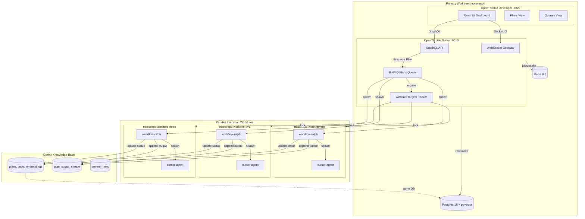
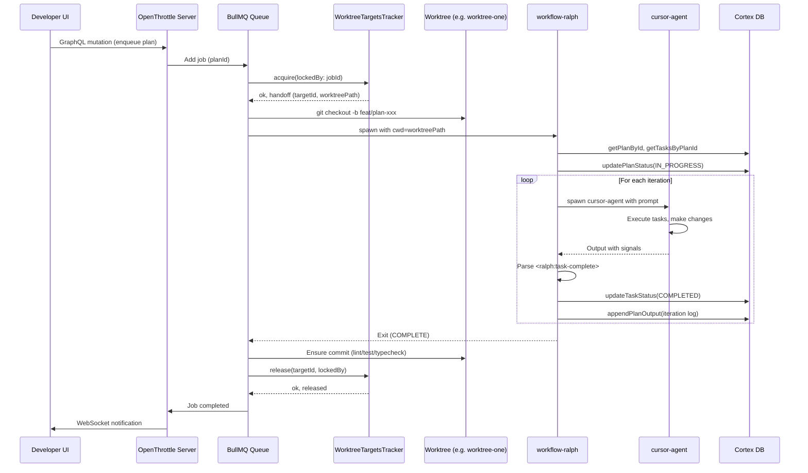

# Multi-Worktree Architecture for OpenThrottle and Ralph Workflows

This document provides high, medium, and low-level overviews of the setup for running the OpenThrottle server and developer applications from the primary worktree while executing Ralph workflows in parallel across multiple worktrees.

---

## High-Level Overview

The architecture consists of three core layers:

1. **Infrastructure Layer** (Primary Worktree: `monorepo`)
   - OpenThrottle Server (NestJS, port 6010) - GraphQL API + WebSocket + BullMQ
   - OpenThrottle Developer (React Router, port **6020** in `applications/openthrottle-developer/.env.default`) — UI dashboard
   - Postgres 18 with pgvector + Redis 8.6

2. **Workflow Orchestration Layer**
   - BullMQ Plans Queue - Receives plan execution jobs
   - WorktreeTargetsTracker - Manages worktree allocation/locking
   - Ralph CLI (`workflow-ralph`) - Executes plans/tasks via cursor-agent

3. **Execution Layer** (Worktrees: `monorepo-worktree-one/two/three`)
   - Isolated git worktrees for parallel plan execution
   - Each worktree runs one Ralph job at a time
   - Independent `.cursor/` folders and MCP servers per worktree

**Key insight**: The server runs from `monorepo` (primary) and dispatches work to the numbered worktrees. This means:

- Plans 1, 2, 3 can run in `worktree-one`
- Plans 4, 5, 6 can run in `worktree-two`
- Plans 7, 8, 9 can run in `worktree-three`

All worktrees share the same Cortex database (Postgres) and Redis, but execute in isolated file system contexts.

---

## Medium-Level Overview

### Component Responsibilities

| Component                  | Location                               | Responsibility                                                |
| -------------------------- | -------------------------------------- | ------------------------------------------------------------- |
| **OpenThrottle Server**    | `applications/openthrottle-server/`    | API, WebSocket, BullMQ job processor                          |
| **OpenThrottle Developer** | `applications/openthrottle-developer/` | UI for plans, tasks, queues, monitoring                       |
| **BullMQ Plans Queue**     | `queues/plans/` in server              | Queue and process plan execution jobs                         |
| **NestjsWorktreesModule**  | `packages/nestjs-worktrees/`           | Provides `WorktreeTargetsTracker` from `WORKTREE_TARGETS` env |
| **workflow-ralph CLI**     | `tools/workflows/`                     | Spawns cursor-agent, parses signals, updates Cortex           |
| **Cortex**                 | `databases/cortex/`                    | Plans, tasks, embeddings, output stream (Postgres + pgvector) |

### Execution Modes

1. **CLI Mode** (Manual)

   ```bash
   pnpm exec workflow-ralph --plan <uuid>
   ```

   - Runs in current working directory
   - Connects to Cortex, fetches plan/tasks, spawns cursor-agent

2. **BullMQ Mode** (Automated via Server)
   - Job enqueued via GraphQL mutation or internal trigger
   - PlansProcessor acquires a worktree target
   - Spawns `workflow-ralph` in the worktree's cwd
   - Releases worktree on completion (success or failure)

### Worktree Target Configuration

In [`applications/openthrottle-server/.env`](../../applications/openthrottle-server/.env):

```bash
WORKTREE_TARGETS='[
  ["worktree-one","/Users/matt/Development/monorepo-worktree-one"],
  ["worktree-two","/Users/matt/Development/monorepo-worktree-two"],
  ["worktree-three","/Users/matt/Development/monorepo-worktree-three"]
]'
```

### Impact on Worktrees

When the server dispatches a job to a worktree:

1. **Lock acquired** - The target is marked as locked by the job ID
2. **Branch created** - A feature branch is created in that worktree
3. **Ralph runs** - `workflow-ralph` executes with `cwd: worktreePath`
4. **Changes committed** - Ralph commits changes per task with `Plan-Id` and `Task-Id`
5. **Lock released** - Target becomes available for the next job

Each worktree operates independently:

- Has its own git branch
- Has its own `.cursor/` folder (MCP servers, rules, commands)
- Uses the same Cortex database (shared plans/tasks)
- Can be opened in a separate Cursor window for manual work

---

## Low-Level Overview

### 1. Job Lifecycle in PlansProcessor

```typescript
// applications/openthrottle-server/src/queues/plans/plans.processor.ts
@Processor(PLANS_QUEUE_NAME, { concurrency: 1 })
export class PlansProcessor extends WorkerHost {
  async process(job: RunPlanJob): Promise<void> {
    const { planId } = job.data;

    // 1. Acquire worktree target
    const result = await runWorktreeWorkflow({
      tracker: this.tracker,
      acquire: { lockedBy: String(job.id), baseBranch: 'main' },
      runLoop: (handoff) => runChildJob({ handoff, planId }),
      ensureCommit: { runChecks: true },
    });

    // 2. Handle results and release (always)
    // result.released is always true when acquire succeeded
  }
}
```

### 2. WorktreeTargetsTracker Interface

```typescript
// tools/workflows/src/types/worktree.ts
interface IWorktreeTargetsTracker {
  acquire(options: { id?: string; lockedBy: string }): AcquireResult;
  release(options: { id: string; lockedBy: string }): ReleaseResult;
  listTargets(): WorktreeTarget[];
  getAvailableTarget(): WorktreeTarget | undefined;
}
```

### 3. Parent Job Handoff

When a worktree is acquired, a handoff object is created:

```typescript
interface ParentJobHandoff {
  targetId: string; // "worktree-one"
  worktreePath: string; // "/Users/matt/Development/monorepo-worktree-one"
  branchName: string; // "feat/plan-xxxx-some-description"
}
```

This handoff is passed to `runChildJob`, which spawns Ralph:

```typescript
// tools/workflows/src/utils/child-job.ts
spawn('pnpm', ['exec', 'workflow-ralph', '--plan', planId], {
  cwd: handoff.worktreePath, // Key: isolated working directory
  stdio: 'inherit',
});
```

### 4. Ralph Iteration Loop

```typescript
// tools/workflows/src/bin/ralph.ts
for (let i = 0; i < iterations; i++) {
  // 1. Spawn cursor-agent with prompt (plan + tasks injected)
  // 2. Parse signals from output:
  //    - <ralph:task-complete>UUID</ralph:task-complete>
  //    - <promise>COMPLETE</promise>
  // 3. Update task status in Cortex
  // 4. Exit on COMPLETE, ERROR, INPUT_REQUIRED, or max iterations
}
```

### 5. Concurrency and Thread Safety

| Scenario            | Tracker Type                       | Max Concurrency       |
| ------------------- | ---------------------------------- | --------------------- |
| Single Node process | In-memory `WorktreeTargetsTracker` | 1 (TOCTOU gap)        |
| Single Node, mutex  | In-memory + mutex                  | N (number of targets) |
| Multiple processes  | Redis-backed tracker               | N (number of targets) |

Current setup uses **in-memory tracker with `concurrency: 1`**, which is safe.

---

## Architecture Diagram



---

## Workflow Sequence Diagram



---

## Best Practices for Your Setup

1. **Run server and developer from primary worktree**
   - Start from `/Users/matt/Development/monorepo`
   - Run `docker compose up` for Postgres + Redis
   - Run `nx serve openthrottle-server` and `nx serve openthrottle-developer`

2. **Configure worktree targets in server `.env`**
   - Set `WORKTREE_TARGETS` with all available worktrees
   - Only include worktrees you want to use for automated execution

3. **Manual work in worktrees**
   - Each numbered worktree can be opened in a separate Cursor window
   - Use for manual plan execution or feature development
   - Avoid opening a worktree that is currently locked by BullMQ

4. **Monitor via Developer UI**
   - Use the Queues view to see pending/active jobs
   - Use the Plans view to see plan status and output stream
   - WebSocket notifications provide real-time updates

5. **Scaling considerations**
   - Current: 3 worktrees = max 3 parallel jobs
   - Add more worktrees to increase parallelism
   - For multi-node deployment, implement Redis-backed tracker

---

## Related Documentation

- [BullMQ Processor Worktree Integration](./bullmq-processor-worktree.md)
- [Worktree Registration and Allocation](../../tools/workflows/docs/worktree-registration-and-allocation.md)
- [Process Model](../../tools/workflows/docs/process-model.md)
- [Ralph Design](./ralph-design.md)
