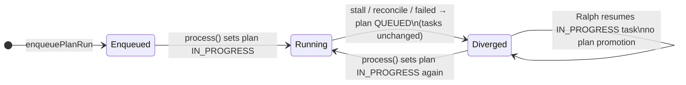

# Plan QUEUED while tasks IN_PROGRESS after mid-run restart

Documents the status divergence investigated in Cortex plan **Investigate parent plan stuck Queued after mid-run job restart while tasks progress** (Plan-Id: `7c8a54a7-cd0f-4a93-ab4f-d39b4d46ead5`). Related: completed plan `67feee49-8a0b-498d-b747-c56dac1a5a9e` (sync parent plan to In Progress when any task enters In Progress). See also [plans-queue-restart-reproduction.md](./plans-queue-restart-reproduction.md) for BullMQ stall/recovery mechanics.

## Symptom

After a plan-run job is interrupted and requeued (worker recycle, API restart, stalled job recovery, worktree delay), Cortex can show:

| Entity                | Status        | UI / OT impact                                                                           |
| --------------------- | ------------- | ---------------------------------------------------------------------------------------- |
| **Plan**              | `QUEUED`      | Plan lists, filters, and “Run plan” affordances treat the plan as waiting, not executing |
| **One or more tasks** | `IN_PROGRESS` | Task board and activity imply work is underway                                           |

This is misleading relative to actual execution (Ralph may still be running, or work clearly continued on tasks while the plan row was reset).

## Root cause (confirmed by code paths)

Divergence is **expected transient behavior** with current reconciliation design, and can **persist** when Ralph resumes tasks without re-promoting the plan.

### 1. Plan-only reset on stall / startup / failure

`PlansProcessor` resets **only the plan** to `QUEUED` when:

- `onModuleInit` → `reconcilePlanStatusOnStartup()` (no active BullMQ job for an `IN_PROGRESS` plan)
- `@OnWorkerEvent('stalled')` → `resetPlanStatusToQueued`
- `@OnWorkerEvent('failed')` → `resetPlanStatusToQueued`
- `handleAllWorktreesLocked` → `resetPlanStatusToQueued` before `moveToDelayed`

Tasks are **not** updated in these paths. Only `enqueuePlanRun` (and related enqueue mutations) bulk-reset tasks to `QUEUED`.

References:

- `applications/openthrottle-server/src/queues/plans/plans.processor.ts` — `reconcilePlanStatusOnStartup`, `resetPlanStatusToQueued`, `onPlanJobStalled`, `onPlanJobFailed`
- Tests: `plans.processor.test.ts` — “Worker events (failed / stalled)”, “reconcilePlanStatusOnStartup”

### 2. Gap window while job is waiting (reproduce without orphan processes)

Typical timeline after abrupt worker stop:

1. Job was **active**; processor set plan `IN_PROGRESS`; Ralph set task(s) `IN_PROGRESS`.
2. Worker dies → lock expires → BullMQ marks job **stalled** → `onPlanJobStalled` sets plan **`QUEUED`**.
3. Task rows remain **`IN_PROGRESS`** (unchanged).
4. Job sits in **waiting** (~`lockDuration` + `stalledInterval`, e.g. ~90s per [plans-queue-restart-reproduction.md](./plans-queue-restart-reproduction.md)) until picked up again.
5. **During step 4:** plan `QUEUED`, tasks `IN_PROGRESS` — confirmed divergence.
6. When `process(job)` runs again, processor unconditionally sets plan `IN_PROGRESS` again — divergence clears **for the plan row** until the next stall.

### 3. Prior plan `67feee49` sync does not cover this case

| Aspect                          | Plan `67feee49` (completed)                                                                                                      | Gap for Queued / requeue                                                                                                       |
| ------------------------------- | -------------------------------------------------------------------------------------------------------------------------------- | ------------------------------------------------------------------------------------------------------------------------------ |
| **Trigger**                     | GraphQL `createTask` / `updateTask` when a task **newly** becomes `IN_PROGRESS` (`previousStatus !== 'IN_PROGRESS'` on update)   | Stall/reconcile sets plan `QUEUED` only; tasks stay `IN_PROGRESS` — no transition, so sync is not invoked                      |
| **SQL predicate**               | `WHERE id = ? AND status != 'IN_PROGRESS'` (TypeORM `Not('IN_PROGRESS')`) — **would** promote `QUEUED` → `IN_PROGRESS` if called | Predicate is fine; **call site** is missing on resume                                                                          |
| **Ralph / direct DB**           | N/A (not in scope of `67feee49`)                                                                                                 | `updateTaskStatus` in `cortex-ralph.ts` never calls sync                                                                       |
| **Plan promotion on job retry** | N/A                                                                                                                              | `PlansProcessor.process` sets plan `IN_PROGRESS` at job start — clears divergence only when the BullMQ job is **active** again |

`TasksService.syncParentPlanToInProgressWhenTaskInProgress` promotes the parent plan when a task **newly** becomes `IN_PROGRESS` via GraphQL:

- Invoked from `createTask` (any new task saved as `IN_PROGRESS`) and `updateTask` only when `saved.status === 'IN_PROGRESS' && previousStatus !== 'IN_PROGRESS'`.

After stall, tasks are **already** `IN_PROGRESS`. Ralph/orchestrator **resume** paths select `firstInProgress` and **skip** `updateTask`, so **sync never runs** while the plan stays `QUEUED` — even though the sync SQL would accept `QUEUED` as a source status.

References:

- `packages/nestjs-repositories/src/modules/tasks/tasks.service.ts`
- `applications/openthrottle-server/src/graphql/tasks/tasks.resolver.ts`
- `tools/workflows/src/bin/ralph.ts` (resume branch: “already IN_PROGRESS”)
- `packages/openthrottle-agentic-ralph/src/utils/orchestrator.ts` (same pattern)

### 4. Ralph direct DB bypasses parent sync entirely

`workflow-ralph` uses `updateTaskStatus` in `tools/workflows/src/utils/cortex-ralph.ts` — unconditional `UPDATE tasks SET status = …` with **no** call to `syncParentPlanToInProgressWhenTaskInProgress`.

`updatePlanStatus(..., 'IN_PROGRESS')` in the same module is **stricter than GraphQL**: it only applies when `plans.status = 'PENDING'`, not when already `IN_PROGRESS` or when `QUEUED`. After reconciliation sets the plan to `QUEUED`, Ralph’s startup `updatePlanStatus(IN_PROGRESS)` is a **no-op** (`null`), while task updates still succeed.

GraphQL `updatePlan` / orchestrator `UpdatePlanDocument` allow `IN_PROGRESS` only from `PENDING` or `IN_PROGRESS` (`canApplyInProgressAsTargetStatus`) — **`QUEUED` is not allowed**, so orchestrator startup `IN_PROGRESS` also fails silently (no touch) when the plan was reset to `QUEUED`.

### 5. Orphan nested Ralph (extended divergence)

If a **spawn** child (`pnpm exec workflow-ralph`) survives parent worker recycle:

- Parent stall handler sets plan `QUEUED`.
- Child keeps iterating, resuming `IN_PROGRESS` tasks and writing output.
- Plan can remain `QUEUED` until a new queue `process(job)` promotes it or a GraphQL path promotes via task transition (unlikely while resuming same task).

## Reproduction steps

Prerequisites match [plans-queue-restart-reproduction.md](./plans-queue-restart-reproduction.md): Cortex Postgres, Redis, openthrottle-server, a plan with at least one long-running task (or restart quickly after job goes active).

### Scenario A — Stall window (most reliable)

1. `enqueuePlanRun` for plan `<planId>` (UI or GraphQL).
2. Wait until plan is `IN_PROGRESS` and at least one task is `IN_PROGRESS` (worker picked up job; Ralph started).
3. Abruptly stop openthrottle-server (Ctrl+C / kill container) while the job is active.
4. Wait for lock expiry + stalled detection (~60–90s with default plans worker constants) **without** starting the server, **or** start the server and wait for `onPlanJobStalled` / startup reconciliation before the job is processed again.
5. Query Cortex (see below).

**Expected observation:** `plan.status === 'QUEUED'` and `tasks[].status === 'IN_PROGRESS'` for the active task(s).

6. Optional: start server and wait until the job is **active** again; re-query plan — plan should return to `IN_PROGRESS` when `PlansProcessor.process` runs.

### Scenario B — Resume without task status change (sync gap)

1. Complete scenario A through step 5 (plan `QUEUED`, task `IN_PROGRESS`).
2. Trigger Ralph only (e.g. `pnpm exec workflow-ralph --plan <planId>`) **while** the BullMQ job is still **waiting** (plan not yet promoted by processor).
3. Ralph logs “Resuming task … (already IN_PROGRESS)” and does not call `updateTask`.
4. Re-query plan.

**Expected:** Plan can remain `QUEUED` until queue processor sets `IN_PROGRESS` or a fix promotes plan when any task is `IN_PROGRESS`.

### Scenario C — GraphQL orchestrator after stall

1. Use `enqueuePlanRalphOrchestrator` (in-process orchestrator) instead of spawn.
2. Repeat interrupt + stall handling so plan becomes `QUEUED` with tasks still `IN_PROGRESS`.
3. On retry, orchestrator calls `updatePlan` with `IN_PROGRESS` first; with plan `QUEUED`, transition is blocked (`canApplyInProgressAsTargetStatus` excludes `QUEUED`).
4. Orchestrator resumes `IN_PROGRESS` task without `updateTask` → same divergence until processor `process()` sets plan `IN_PROGRESS`.

## What to query

**Plan and tasks**

```graphql
query PlanWithTasks($id: ID!) {
  plan(id: $id) {
    id
    title
    status
    updatedAt
  }
  tasksByPlanId(input: { planId: $id }) {
    id
    title
    status
    updatedAt
  }
}
```

**Queue (optional)**

```graphql
query PlansQueue {
  queue(input: { name: "plans" }) {
    name
    waitingCount
    activeCount
    failedCount
  }
}
```

**Logs**

- `Plan status reconciliation: resetting plan … from IN_PROGRESS to QUEUED`
- `Plan status reset to QUEUED (reason=stalled|failed|all_worktrees_locked|…)`

## State diagram (simplified)



## Conclusion for follow-up tasks

- **Reproduced / documented:** Plan `QUEUED` + tasks `IN_PROGRESS` is reproducible in the stall/requeue window and can persist when Ralph resumes without a task status transition.
- **Not fixed by plan `67feee49`:** Parent sync runs on **new** task `IN_PROGRESS` via GraphQL only; it does not run for Ralph direct DB or for “already IN_PROGRESS” resume after plan reset.
- **Processor** still promotes plan on job `process()` start, but UI/OT can be wrong during waiting/retry and during orphan/spawn resume gaps.

## Proposed fix (recommended implementation plan)

**Goal:** Plan status should reflect “execution is underway” whenever at least one task is `IN_PROGRESS`, including after stall/requeue and Ralph resume without a task transition. Keep downward reconciliation (no active job → plan `QUEUED`) but add symmetric **upward** reconciliation and align all promotion paths on the same predicate.

### Recommended approach (layered, smallest blast radius first)

#### Layer 1 — Reuse existing sync SQL everywhere (highest leverage)

`TasksService.syncParentPlanToInProgressWhenTaskInProgress` already promotes `QUEUED` → `IN_PROGRESS` (`WHERE status != 'IN_PROGRESS'`). Extend **call sites**, not the SQL:

| Call site                                      | Change                                                                                                                                                                                                                                                                                                                                 |
| ---------------------------------------------- | -------------------------------------------------------------------------------------------------------------------------------------------------------------------------------------------------------------------------------------------------------------------------------------------------------------------------------------- |
| **`workflow-ralph` startup** (`ralph.ts` ~142) | After `updatePlanStatus(IN_PROGRESS)` (or replace it), call sync when any task is `IN_PROGRESS` or when plan is `QUEUED`/`PENDING` and work remains. Prefer a shared helper in `cortex-ralph.ts`: `promotePlanToInProgressIfNeeded(planId)` using `UPDATE plans SET status = 'IN_PROGRESS' WHERE id = $1 AND status != 'IN_PROGRESS'`. |
| **Ralph resume branch** (`ralph.ts` ~214–217)  | When resuming `firstInProgress`, call the same promote helper (no `updateTask` required).                                                                                                                                                                                                                                              |
| **Orchestrator** (`orchestrator.ts` ~114–117)  | After failed/blocked `updatePlan(IN_PROGRESS)`, if plan still not `IN_PROGRESS`, call GraphQL path that uses sync (see Layer 2) or add `syncParentPlan…` via a thin mutation/service.                                                                                                                                                  |
| **`updateTaskStatus` (direct DB)**             | Optional: after setting task `IN_PROGRESS`, call promote helper for `planId` (covers MCP/scripts that bypass GraphQL).                                                                                                                                                                                                                 |

**Fix `cortex-ralph.updatePlanStatus` for `IN_PROGRESS`:** Change predicate from `WHERE status = 'PENDING'` to `WHERE status != 'IN_PROGRESS'` (match `syncParentPlanToInProgressWhenTaskInProgress`). Update JSDoc and `openthrottle-ralph-parity.ts`. Add unit tests in `tools/workflows` for promote from `QUEUED`.

#### Layer 2 — GraphQL `IN_PROGRESS` policy includes `QUEUED`

In `plans.resolver.ts`, extend `canApplyInProgressAsTargetStatus`:

```ts
return s === 'PENDING' || s === 'IN_PROGRESS' || s === 'QUEUED';
```

This fixes orchestrator `UpdatePlanDocument` after stall without a separate mutation. Add resolver tests: `QUEUED` → `IN_PROGRESS` succeeds; `COMPLETED` → `IN_PROGRESS` still blocked.

Keep parity: `cortex-ralph` and GraphQL should accept the same source statuses for `IN_PROGRESS`.

#### Layer 3 — Server startup / stall upward reconciliation (closes UI gap during waiting)

Add **`reconcilePlanStatusFromActiveTasksOnStartup`** (mirror of `reconcilePlanStatusOnStartup`) in `PlansProcessor`:

1. Find plans with `status = 'QUEUED'` (and optionally `PENDING` if product agrees).
2. For each, if any task has `status = 'IN_PROGRESS'`, call `tasksService.syncParentPlanToInProgressWhenTaskInProgress(planId)` and emit `PLAN_STATUS_CHANGED` when promoted.
3. Run after existing downward reconcile on `onModuleInit`.

Optional: invoke the same helper at end of `resetPlanStatusToQueued` **only when** tasks remain `IN_PROGRESS` (debated: may fight “plan waiting in queue” semantics; prefer startup + Ralph paths first).

**Do not** reset tasks to `QUEUED` on stall (breaks resume semantics and diverges from enqueue-only task reset).

### Options considered and rejected

| Option                                      | Why not                                                          |
| ------------------------------------------- | ---------------------------------------------------------------- |
| Reset tasks on stall                        | Loses in-flight task state; only enqueue should bulk-reset tasks |
| Only rely on `process()` plan `IN_PROGRESS` | Leaves 60–90s+ window and orphan-spawn gaps                      |
| New plan status (e.g. `RECOVERING`)         | UI/schema churn; `IN_PROGRESS` already means “running”           |

### Tests

| Area                                 | Test                                                                                                                                                                  |
| ------------------------------------ | --------------------------------------------------------------------------------------------------------------------------------------------------------------------- |
| **`tasks.service.test.ts`**          | Already covers sync SQL; add case documenting `QUEUED` source is promoted (same `Not('IN_PROGRESS')` call).                                                           |
| **`plans.resolver.test.ts`**         | `updatePlan` / `setPlanStatus`: `QUEUED` → `IN_PROGRESS` allowed; emit notification.                                                                                  |
| **`plans.processor.test.ts`**        | New describe `reconcilePlanStatusFromActiveTasksOnStartup`: plan `QUEUED` + task `IN_PROGRESS` → plan `IN_PROGRESS`; plan `QUEUED` + all tasks `PENDING` → unchanged. |
| **`cortex-ralph` / `ralph.test.ts`** | `updatePlanStatus(IN_PROGRESS)` updates when plan is `QUEUED`; Ralph resume logs path calls promote helper.                                                           |
| **`orchestrator` tests**             | After mock plan `QUEUED`, bootstrap promotes to `IN_PROGRESS` when tasks include `IN_PROGRESS`.                                                                       |
| **Integration (manual)**             | Scenarios A–C in this doc; re-query GraphQL after stall before job active.                                                                                            |

### Monitoring (optional, low cost)

- **Log metric / structured log** when `resetPlanStatusToQueued` runs and a query finds `IN_PROGRESS` tasks for the same `planId` (count > 0). Name e.g. `plan_status_divergence_detected`. Helps validate fix rate in staging.
- **Dashboard / alert (later):** SQL view or periodic check: `plans.status = 'QUEUED' AND EXISTS (tasks IN_PROGRESS)` — should trend to zero after fix.

### Implementation follow-up (suggested OT plan)

Create a single implementation plan (e.g. **“Fix plan QUEUED vs task IN_PROGRESS after requeue”**) with tasks:

1. GraphQL + `cortex-ralph` parity for `QUEUED` → `IN_PROGRESS`.
2. Ralph + orchestrator promote-on-resume / startup.
3. `reconcilePlanStatusFromActiveTasksOnStartup` in `PlansProcessor`.
4. Tests per table above.
5. Manual verification using Scenarios A–B; close investigation plan `7c8a54a7-cd0f-4a93-ab4f-d39b4d46ead5`.

**Estimated scope:** ~4–6 files, no schema migration; backward-compatible GraphQL (widens allowed transition).

## Verification (plan `f8fb7f3b-0816-4e65-8b39-76e7248d381f`, 2026-05-28)

Implementation landed in plan `f8fb7f3b`. Automated coverage maps to manual scenarios as follows:

| Scenario                                     | What was verified                                                                                                        | Evidence                                                                                                                                               |
| -------------------------------------------- | ------------------------------------------------------------------------------------------------------------------------ | ------------------------------------------------------------------------------------------------------------------------------------------------------ |
| **A — Stall window**                         | Upward reconcile on server startup promotes `QUEUED` plan when any task is `IN_PROGRESS` and emits `plan.status_changed` | `plans.processor.test.ts` — “promotes QUEUED plans that have an IN_PROGRESS task…”                                                                     |
| **B — Ralph resume without task transition** | `promotePlanToInProgressIfNeeded` at Ralph startup and on resume branch                                                  | `cortex-ralph.test.ts` — `QUEUED` → `IN_PROGRESS`; `ralph.ts` calls helper at startup (~143) and resume (~217)                                         |
| **C — Orchestrator after stall**             | GraphQL allows `QUEUED` → `IN_PROGRESS`; orchestrator promotes when resuming `IN_PROGRESS` task                          | `plans.resolver.test.ts`; `ralph-orchestrator.test.ts` — “promotes plan when resuming an IN_PROGRESS task while plan is QUEUED”                        |
| **WebSocket UI sync**                        | Plan detail revalidates on `plan.status_changed` / `task.status_changed` without full reload                             | `plans.$planId._index.tsx` socket handlers call `revalidator.revalidate()`; emission inventory in `docs/openthrottle/notifications-websockets-plan.md` |

**Test commands (all green on 2026-05-28):**

```bash
pnpm exec vitest run applications/openthrottle-server/src/queues/plans/plans.processor.test.ts \
  applications/openthrottle-server/src/graphql/plans/plans.resolver.test.ts \
  applications/openthrottle-server/src/graphql/tasks/tasks.resolver.test.ts \
  applications/openthrottle-server/src/notifications/emit-bulk-task-status-changes.test.ts

pnpm nx run workflows:test --testPathPattern="cortex-ralph.test|ralph.test"
pnpm nx run @openthrottle/openthrottle-workflows:test --testPathPattern=ralph-orchestrator.test
```

**Operator manual sign-off (optional):** Run scenarios A–C against a live stack (server + Redis + developer app) per steps above; confirm plan detail badge updates without refresh when status changes via enqueue, stall recovery, or CLI Ralph resume.

**Investigation closed:** Plan `7c8a54a7-cd0f-4a93-ab4f-d39b4d46ead5` — root cause documented here; fix shipped in plan `f8fb7f3b`.

### Acceptance criteria

- After stall, before BullMQ job is active again: plan shows `IN_PROGRESS` if any task is `IN_PROGRESS` (within seconds of server restart or Ralph resume).
- `pnpm exec workflow-ralph --plan <id>` with plan `QUEUED` and task `IN_PROGRESS` promotes plan at startup.
- Orchestrator path after stall promotes plan without requiring `updateTask`.
- No regression: enqueue still sets plan + tasks `QUEUED`; downward reconcile still resets orphan `IN_PROGRESS` plans without active jobs.
