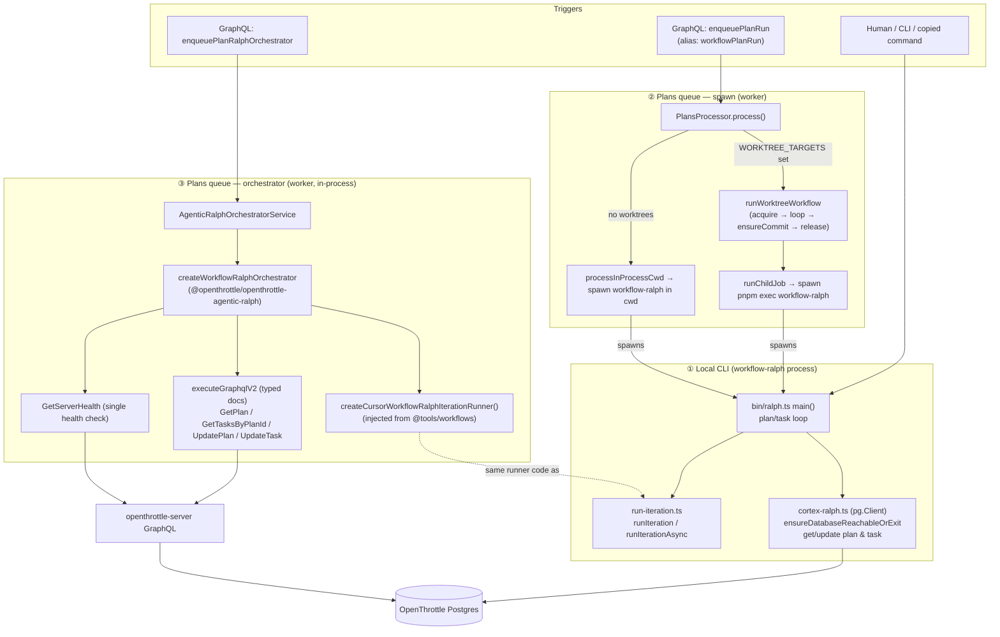
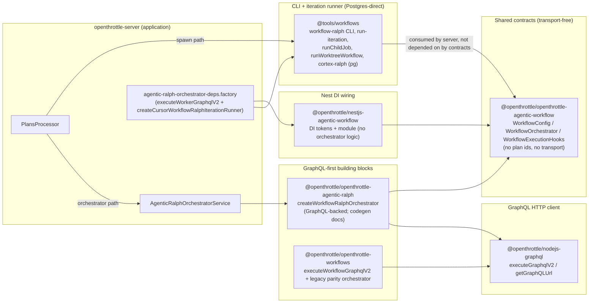

# Ralph execution paths and package layering

> **Status:** Authoritative map of how Ralph runs **today** (Phase 1 of plan
> `a1c55a0a-735c-4f60-965a-7f122acbdc8f`, task `ee1624a3-ae7c-43c9-a570-f78e6e60d71a`).
> Captures the three execution surfaces, the package layers + dependency direction, and where
> transport is **Postgres** vs **GraphQL** today (plus the single health check). The intended end
> state (deprecate `@tools/workflows`, GraphQL-only, before/after hooks) is the **Target
> architecture**; see the parent plan and the canonical decision table in `tools/workflows/README.md`.

## TL;DR — which path is at play and when

| #   | Surface                        | Trigger                                                                                                  | Host process                                                      | Ralph loop implementation                                                                    | Transport (OT plan/task)                                                | Worktree                                                                       | Iteration runner                                                                             |
| --- | ------------------------------ | -------------------------------------------------------------------------------------------------------- | ----------------------------------------------------------------- | -------------------------------------------------------------------------------------------- | ----------------------------------------------------------------------- | ------------------------------------------------------------------------------ | -------------------------------------------------------------------------------------------- |
| 1   | **Local CLI**                  | `pnpm exec workflow-ralph --plan/--task …` (human, copy-from-UI, nested child of #2)                     | The `workflow-ralph` Node process itself                          | `tools/workflows/src/bin/ralph.ts` → `main()`                                                | **Postgres-direct** (`cortex-ralph.ts`, `pg.Client`)                    | No (one runner subprocess per iteration in cwd)                                | `runIteration` / `runIterationAsync` (`bin/run-iteration.ts`)                                |
| 2   | **Plans queue — spawn**        | GraphQL `enqueuePlanRun` (canonical) / `workflowPlanRun` (deprecated alias) → BullMQ job name `run-plan` | `openthrottle-server` worker → **child** `workflow-ralph` process | Delegates to surface #1 inside a worktree (or cwd) via `runChildJob` / `processInProcessCwd` | **Postgres-direct** (child = #1; parent reads tasks via `cortex-ralph`) | Yes when `WORKTREE_TARGETS` set (`runWorktreeWorkflow`); otherwise process cwd | Child process owns iterations (#1)                                                           |
| 3   | **Plans queue — orchestrator** | GraphQL `enqueuePlanRalphOrchestrator` → BullMQ job name `Agentic Ralph`                                 | `openthrottle-server` worker, **in-process** (no child CLI)       | `createWorkflowRalphOrchestrator` (`@openthrottle/openthrottle-agentic-ralph`)               | **GraphQL** (`executeGraphqlV2` typed documents)                        | No (no worktree loop, no spawn)                                                | `createCursorWorkflowRalphIterationRunner()` (from `@tools/workflows`), injected via Nest DI |

Surfaces #1 and #2 are the **Postgres-direct** lineage (`@tools/workflows`). Surface #3 is the
**GraphQL-first** lineage and the basis for the target architecture.

## Surface diagram

Key observations from the diagram:

- **Surface #2 always bottoms out in Surface #1.** The worker spawns a child `workflow-ralph`
  process; the child re-runs `main()` with its own Postgres-direct connection. So the spawn path
  inherits #1's transport (Postgres) and exit semantics.
- **Surface #3 never spawns `workflow-ralph`.** It runs the loop in the worker process and talks
  to the server over GraphQL. The only `@tools/workflows` code it borrows is the **iteration
  runner** (`createCursorWorkflowRalphIterationRunner`), injected via Nest DI — not the CLI, the
  Postgres client, or the worktree workflow.
- **The orchestrator loop is a deliberate parity re-implementation** of `ralph.ts main()` (same
  task selection, `<ralph:task-complete>` / `<promise>COMPLETE</promise>` parsing, PENDING reset on
  max iterations), but using GraphQL mutations instead of `pg` writes.

## Package layers and dependency direction

### Layer responsibilities and dependency direction (table)

| Package                                       | Role                                                                                                                                                                                                                                | Depends on (workspace)                                                     | Transport                                   | Notes                                                                                                                                                                 |
| --------------------------------------------- | ----------------------------------------------------------------------------------------------------------------------------------------------------------------------------------------------------------------------------------- | -------------------------------------------------------------------------- | ------------------------------------------- | --------------------------------------------------------------------------------------------------------------------------------------------------------------------- |
| `@openthrottle/openthrottle-agentic-workflow` | **Shared contracts**: `WorkflowConfig`, `WorkflowOrchestrator`, `WorkflowRunResult`, `WorkflowExecutionHooks`, run-log event constants                                                                                              | _(none)_                                                                   | **None** (transport-free, no plan/task ids) | The dependency sink — everything points here, it points nowhere. Hooks contract lives here for Phase 2.                                                               |
| `@openthrottle/openthrottle-agentic-ralph`    | **GraphQL-backed orchestrator** (`createWorkflowRalphOrchestrator`), Ralph context builders, codegen GraphQL documents, agent-output parsing                                                                                        | `openthrottle-agentic-workflow`, `nodejs-graphql`                          | **GraphQL** (`executeGraphqlV2` typed docs) | The **active** orchestrator used by the server (Surface #3). Parity target = `ralph.ts main()`.                                                                       |
| `@openthrottle/openthrottle-workflows`        | **GraphQL-first building blocks**: `executeWorkflowGraphqlV2`, flow-context helpers, and a **legacy** `createWorkflowRalphOrchestrator` (parity copy)                                                                               | `nodejs-graphql`                                                           | **GraphQL**                                 | Older sibling of `openthrottle-agentic-ralph`. The server explicitly uses the `agentic-ralph` orchestrator, **not** this one. Candidate for consolidation in Phase 2. |
| `@openthrottle/nestjs-agentic-workflow`       | **Nest DI wiring + tokens** (`AGENTIC_WORKFLOW_EXECUTE_GRAPHQL_V2`, `AGENTIC_WORKFLOW_WORKER_GRAPHQL_AUTH`, `AGENTIC_WORKFLOW_RALPH_ORCHESTRATOR_DEPS`), `NestjsAgenticWorkflowModule`                                              | `openthrottle-agentic-workflow`                                            | **None** (wiring only)                      | Provides the executor + auth as injectables; re-exports contract types. No orchestrator logic.                                                                        |
| `@tools/workflows`                            | **CLI + iteration runner (Postgres-direct)**: `workflow-ralph` bin, `run-iteration`, `runChildJob`, `runWorktreeWorkflow`, `cortex-ralph` (`pg`), nested-argv builders, job-run lifecycle hooks (today: `before_run` / `after_run`) | `@openthrottle/ai-mcp` (`getPostgresConfig`, `buildWorkflowRalphSpawnEnv`) | **Postgres-direct** (`pg.Client`)           | Powers Surfaces #1 and #2. Surface #3 borrows only `createCursorWorkflowRalphIterationRunner`. **This is the package the Phase 2 migration deprecates.**              |
| `@openthrottle/nodejs-graphql`                | Low-level GraphQL HTTP client (`executeGraphqlV2`, `getGraphQLUrl`)                                                                                                                                                                 | _(infra)_                                                                  | **GraphQL**                                 | Shared HTTP transport for the GraphQL-first lineage.                                                                                                                  |

**Dependency rule today:** contracts (`openthrottle-agentic-workflow`) are the sink; the GraphQL
orchestrators and Nest wiring depend on it. `@tools/workflows` does **not** sit under the contracts
— the application (`openthrottle-server`) depends _outward_ onto both `@tools/workflows` (spawn
path + injected runner) and `openthrottle-agentic-ralph` (orchestrator path). That outward
application dependency on `@tools/workflows` is exactly what Phase 2 removes.

## Transport boundary: Postgres vs GraphQL (today)

| Concern                | Surface #1 (CLI)                                            | Surface #2 (spawn)                                                                 | Surface #3 (orchestrator)                                                |
| ---------------------- | ----------------------------------------------------------- | ---------------------------------------------------------------------------------- | ------------------------------------------------------------------------ |
| Preflight / health     | `ensureDatabaseReachableOrExit` → `pg` connect + `SELECT 1` | Parent: `ensureCortexReachable` (`pg`); child: same as #1                          | `GetServerHealth` GraphQL query (the **single** documented health check) |
| Plan/task fetch        | `getPlanById` / `getTasksByPlanId` (`pg`)                   | child = #1; parent `getTasksByPlanId` (`pg`) to mark plan complete                 | `GetPlanDocument` / `GetTasksByPlanIdDocument` (GraphQL)                 |
| Status updates         | `updatePlanStatus` / `updateTaskStatus` (`pg`)              | via child (#1)                                                                     | `UpdatePlanDocument` / `UpdateTaskDocument` (GraphQL)                    |
| Plan output stream     | agent via OT MCP (optional)                                 | `appendPlanOutput` (`pg`) for streamed chunks                                      | streamed to BullMQ run output; OT writes via GraphQL                     |
| Postgres config source | CLI process `POSTGRES_*` / URL (`getPostgresConfig`)        | worker passes `canonicalCortexPostgresUrl` (`getCortexPostgresUrl`) into child env | n/a (no direct Postgres)                                                 |

### The single health-check exception

- Surface #3's orchestrator calls `GetServerHealth` once at bootstrap (before the first real
  GraphQL mutation). This is the **one** intentional read-before-write preflight and the model for
  the Phase 2 "GraphQL-only except one health check" rule.
- Surfaces #1/#2 do **not** use `GetServerHealth`; they use a **Postgres TCP** check
  (`ensureDatabaseReachableOrExit` / `ensureCortexReachable`). These are the Postgres-direct paths
  flagged for migration to GraphQL in Phase 2 (task `f4bf218a`).

## Postgres-direct access paths to migrate (Phase 2 input)

These are the `@tools/workflows` entry points that talk to Postgres directly and must move to
GraphQL when surfaces #1/#2 are folded under the Nest/GraphQL abstraction:

- `cortex-ralph.ts`: `ensureDatabaseReachableOrExit`, `ensureCortexReachable`, `getPlanById`,
  `getTaskById`, `getTasksByPlanId`, `updatePlanStatus`, `updateTaskStatus`, `appendPlanOutput`,
  `promotePlanToInProgressIfNeeded`, commit-link writes (all `pg.Client`).
- `child-job.ts`: `getPostgresConfig()` plan lookup + `ensureCortexReachable` before spawn.
- `bin/ralph.ts`: `getCortexConfigOrExit()` + `ensureDatabaseReachableOrExit()` startup.

## Cross-links

- **Single canonical decision table** (trigger → surface → host process → transport → post-run
  checks): [`tools/workflows/README.md` → Which path runs when](../../tools/workflows/README.md#which-path-runs-when-canonical-decision-table).
- **Target architecture (Phase 2):** [`tools/workflows/README.md` → Target architecture](../../tools/workflows/README.md#target-architecture-phase-2).
- GraphQL mutations: `enqueuePlanRun` (canonical), `enqueuePlanRalphOrchestrator`, deprecated
  `workflowPlanRun` alias — see [`tools/workflows/README.md` → Worktree + BullMQ workflow](../../tools/workflows/README.md#worktree--bullmq-workflow-fan-outfan-in).
- Worktree workflow + BullMQ processor: `docs/workflows/bullmq-processor-worktree.md`,
  `docs/workflows/multi-worktree-architecture.md`.
- Ralph design + runtime config: `docs/workflows/ralph-design.md`,
  `docs/workflows/ralph-workflow-runtime-config.md`.
- Lifecycle hooks (today's `before_run` / `after_run`): `JOB_RUN_LIFECYCLE_HOOKS.md`
  (Phase 2 expands these to Jest-style `beforeAll` / `beforeEach` / `afterEach` / `afterAll`).
- Jest-style lifecycle hooks as BullMQ child jobs (Phase 2 design):
  [`jest-style-lifecycle-hooks-as-bullmq-child-jobs.md`](./jest-style-lifecycle-hooks-as-bullmq-child-jobs.md).
- Parent plan: `a1c55a0a-735c-4f60-965a-7f122acbdc8f`.
