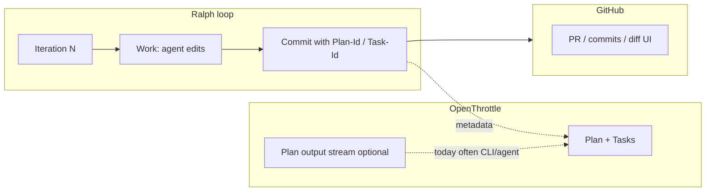
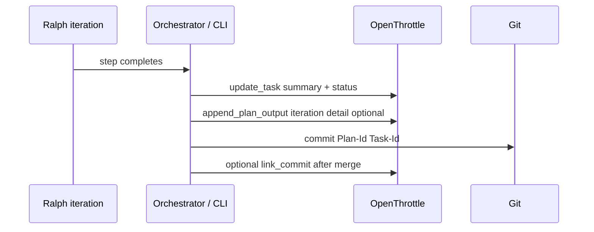
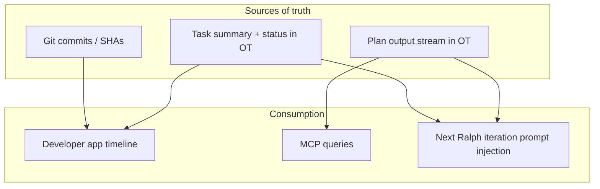

# Ralph loop step context: brainstorm (summary without GitHub)

**OpenThrottle plan:** `c6d0d88c-5fb0-4b11-8da0-bd68a89e20d4`

## Goals

- **See what happened each Ralph step** (iteration / task completion) without opening GitHub for commit history or diffs.
- **Reuse that context** later: debugging a stuck loop, onboarding a human, feeding the next iteration, or auditing “why did we change X?”
- **Stay aligned with traceability** you already want: Plan ID and Task ID in commits remain valuable for git ↔ OT linkage; this doc focuses on _step narrative_ and _structured artifacts_, not replacing commit metadata.

## Constraints and realities

| Constraint                             | Implication                                                                                                  |
| -------------------------------------- | ------------------------------------------------------------------------------------------------------------ |
| Commits are authoritative for **code** | Step summaries should reference SHAs or file paths when it matters, but the **story** can live outside git.  |
| Ralph runs can be noisy                | Raw logs help ops; **humans** need condensed summaries or structured fields.                                 |
| OT already stores plans/tasks          | Natural place for **plan-scoped** narrative if we avoid duplicating git unnecessarily.                       |
| Cost / latency                         | Full diff embedding every iteration is expensive; **tier** what gets stored (summary vs excerpt vs pointer). |

## Current state (mental model)

**Today:** traceability from git → OT is strong if commits include footers. **Gap:** the _semantic_ “what we did this step” is split across GitHub UI, local git, and optionally OT plan output—nothing guarantees a **single step-level timeline** unless you discipline logging.

## Solution axes (brainstorm)

### 1. Lean on OT plan output (`append_plan_output`)

**Idea:** Treat each iteration (or each completed task) as an explicit append to the plan output stream with a short template: outcome, files touched, blockers, next step.

- **Pros:** Already modeled in OT; searchable via existing Cortex flows; no new tables required for a first version.
- **Cons:** Unstructured text unless you enforce a schema in the prompt or CLI; mixing “agent ramble” with “human summary” unless you separate channels.

### 2. Structured “iteration record” (new or extended schema)

**Idea:** Persist records keyed by `(planId, iteration?, taskId?)` with fields like: `summary`, `filesChanged[]`, `commitSha?`, `testsRun`, `riskNotes`.

- **Pros:** Queryable; drives UI cards and filters; can power “last N steps” without GitHub.
- **Cons:** Implementation + migration; must define who writes it (orchestrator vs worker vs agent).

### 3. Task-level PRD fields you already have

**Idea:** When a task completes, require a concise **`summary`** on the task (your repo guidelines already mention PRD summarization). Ralph CLI or MCP updates the task with “what shipped.”

- **Pros:** Aligns work units with narrative; shows up in developer UI without new concepts.
- **Cons:** One summary per task, not per micro-iteration unless you create subtasks or multiple updates.

### 4. CLI / local artifact (`ralph-step.jsonl` or run manifest)

**Idea:** Each iteration writes a JSON line to the worktree or to OT via API: compact machine-readable trace.

- **Pros:** Great for debugging Ralph itself; works offline; easy to diff locally.
- **Cons:** Not visible to other collaborators unless synced to OT or CI uploads it.

### 5. Hybrid (recommended direction for a spike)

**Idea:** Combine **structured task updates** (what shipped / blocked) + **optional plan output** (verbose agent trace) + **commit SHA pointer** when a commit exists.

**Why hybrid:** Humans read **task summaries** and a short **plan output tail**; git stays canonical for code; merge still links one SHA via existing `link_commit` workflow.

## UX surfaces (without GitHub)

| Surface                              | What you see                                                                             |
| ------------------------------------ | ---------------------------------------------------------------------------------------- |
| **openthrottle-developer plan page** | Timeline: task status changes + summaries + last plan output chunks (if surfaced in UI). |
| **MCP / `get_plan_output`**          | Full stream for agents or scripts.                                                       |
| **CLI**                              | `workflow-ralph` or a small `pnpm exec` that prints last N iterations from OT API.       |

_(Which of these exists today vs needs UI work is a follow-up spike; the brainstorm is about **where** the data should live.)_

## Diagram: where “step story” should land

## Risks

- **Duplication:** Same sentence in commit body, task summary, and plan output—mitigate with clear roles: commit = conventional + IDs; task = user-facing “what shipped”; plan output = verbose trace.
- **PII / secrets:** Summaries must inherit whatever redaction you use elsewhere.
- **Volume:** Cap plan output chunk size or summarize older iterations.

## Possible next spike (for implementation planning)

1. Define a **minimal iteration payload**: `planId`, `taskId?`, `iteration`, `summary` (1–3 sentences), `filesTouched[]`, `commitSha?`.
2. Decide **writer**: orchestrator after successful iteration vs worker post-commit.
3. **Expose** last N payloads in developer UI or a read-only MCP tool if missing.
4. Keep GitHub as optional detail view, not the primary narrative.

---

_This document is a living brainstorm tied to OT plan `c6d0d88c-5fb0-4b11-8da0-bd68a89e20d4`; refine or split into implementation tasks as decisions land._
