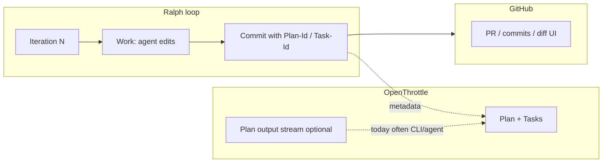
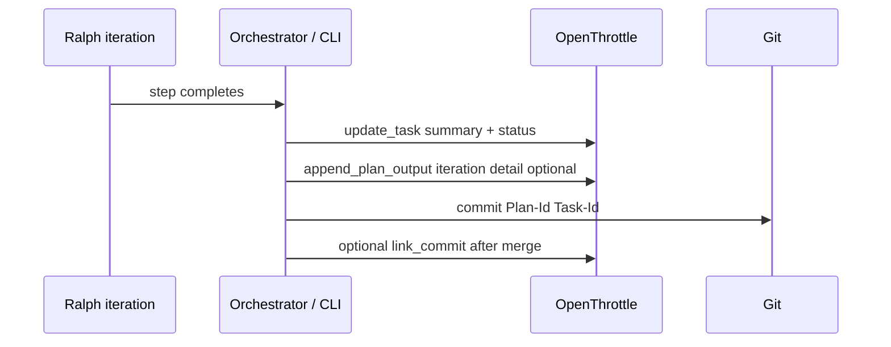
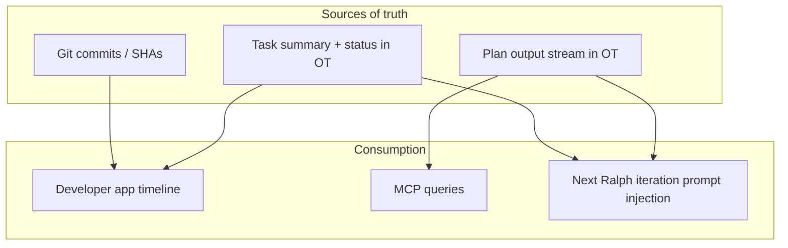

# Ralph loop step context: brainstorm (summary without GitHub)

**OpenThrottle plan:** `c6d0d88c-5fb0-4b11-8da0-bd68a89e20d4`

## Problem statement

Ralph advances work by completing tasks across iterations. Today, **git** is the natural place to see _what code changed_, and **OpenThrottle** holds the plan, task statuses, and optional `plan_output_stream`. Traceability from branch commits back to a plan/task is supported via **`Plan-Id` / `Task-Id` footers** in commit messages, while **landed** work is summarized in OT via **`commit_links`** (squash SHA after merge). None of that guarantees a **readable, ordered narrative per iteration** inside OT or the developer app: to understand _what happened in step N_ (decisions, scope, files touched, partial attempts), people still reach for **GitHub** (PR, compare, commit list). The goal of this brainstorm is options to **summarize and reuse step-level context** without treating GitHub as the primary story.

## Goals

- **See what happened each Ralph step** (iteration / task completion) without opening GitHub for commit history or diffs.
- **Reuse that context** later: debugging a stuck loop, onboarding a human, feeding the next iteration, or auditing “why did we change X?”
- **Stay aligned with traceability** you already want: Plan ID and Task ID in commits remain valuable for git ↔ OT linkage; this doc focuses on _step narrative_ and _structured artifacts_, not replacing commit metadata.

## Constraints and realities

| Constraint                             | Implication                                                                                                  |
| -------------------------------------- | ------------------------------------------------------------------------------------------------------------ |
| Commits are authoritative for **code** | Step summaries should reference SHAs or file paths when it matters, but the **story** can live outside git.  |
| Ralph runs can be noisy                | Raw logs help ops; **humans** need condensed summaries or structured fields.                                 |
| OT already stores plans/tasks          | Natural place for **plan-scoped** narrative if we avoid duplicating git unnecessarily.                       |
| Cost / latency                         | Full diff embedding every iteration is expensive; **tier** what gets stored (summary vs excerpt vs pointer). |

## What Plan-Id / Task-Id give today

- **Branch commits:** Footers like `Plan-Id: <uuid>` and `Task-Id: <uuid>` tie a commit message to Cortex rows. Humans and scripts can **grep** history locally; the linkage is **textual**, not a first-class per-step record in Postgres until merge tooling runs.
- **After squash merge:** `link_commit` (or `workflow-link-merge`) stores one row in **`commit_links`** (plan, optional task, repo, squash SHA, message). **`get_activity_by_date`** and **`get_last_activity`** surface **landed** commits only—not every Ralph iteration commit on a feature branch.
- **Tasks table:** Status transitions (`QUEUED` → `COMPLETED`, etc.) and optional **`summary`** give a **per-task** wrap-up when filled; they do not by themselves capture **each iteration’s** reasoning or intermediate state.
- **Plan output stream:** **`append_plan_output` / `get_plan_output`** can log iteration text into **`plan_output_stream`** (ordered chunks, optional `iteration`). Workers can append metrics lines; nested Ralph with **`streamToCortex`** can mirror stdout/stderr. **Coverage is optional** and often unstructured unless prompts or orchestration enforce a shape.

## Commits vs OT plan output (current roles)

| Dimension                    | Git commits (+ Plan-Id / Task-Id)                                                           | OT `plan_output_stream`                                                            |
| ---------------------------- | ------------------------------------------------------------------------------------------- | ---------------------------------------------------------------------------------- |
| **Source of truth for code** | Yes (diffs, SHAs, blame).                                                                   | No.                                                                                |
| **Granularity**              | One commit per logical chunk (agent-dependent); may bundle multiple sub-steps.              | Many append chunks per plan; can align to iteration if writers set `iteration`.    |
| **When OT “sees” it**        | Branch: only via message parsing. Main: **`commit_links`** after merge.                     | Immediately when MCP/workers/agents append.                                        |
| **Best for**                 | Auditing **what merged**, bisect, code review.                                              | **Narrative / log** while the loop runs; agent-visible tail for `get_plan_output`. |
| **Without GitHub**           | Local `git log` still works; **no** friendly plan-scoped timeline in OT from commits alone. | Readable in OT **if** something appends consistently; otherwise empty or noisy.    |

## Current state (mental model)

## Gaps for step-level narrative

- **No required artifact per iteration:** Unlike task status, there is no schema-enforced “step N summary” stored for every Ralph loop; plan output and task summaries are **conventions**, not guarantees.
- **Split attention:** Code story lives in **git/GitHub**; intent and agent trace may live in **OT or only in the terminal**—reviewers must mentally join them.
- **Branch commits vs activity APIs:** Pre-merge commits with Plan-Id/Task-Id are **not** the same as `commit_links`; **`get_activity_by_date`** will not list every iteration commit until (if) they land as linked squash SHAs.
- **Unstructured plan output:** Raw streams help debugging but are weak for “what changed this step?” unless summarized or templated.
- **UI surfacing:** Even when chunks exist, the **developer app** may not yet expose a first-class “iteration timeline” (product gap depends on current UI; data model supports append + read).

## Solution axes (brainstorm)

### Lightweight logging vs structured iteration records

| Aspect                   | Lightweight (free-form text, e.g. `append_plan_output` chunks, prose in task `summary`) | Structured (typed columns, JSON schema, or a dedicated `iteration_steps`-style table) |
| ------------------------ | --------------------------------------------------------------------------------------- | ------------------------------------------------------------------------------------- |
| **Time to ship**         | Minutes: prompt or CLI appends a template line after each step.                         | Days+: schema design, migrations, validation, backfill story.                         |
| **Query / filter**       | Full-text or “last N chunks”; weak for “all steps that touched `foo.ts`”.               | Strong: index by `task_id`, `iteration`, `files_changed`, etc.                        |
| **Agent reliability**    | Models drift from templates; easy to omit fields.                                       | Validators reject incomplete rows; can still fail if the writer skips the API call.   |
| **Human readability**    | Natural language; good for narrative if quality is consistent.                          | Cards and tables in UI; may need a generated prose layer for humans.                  |
| **Token / storage cost** | Duplication and ramble inflate size unless capped or summarized.                        | Smaller payloads if fields are short; embeddings optional per row.                    |
| **Best when**            | You want **visibility fast** and can tolerate messy streams.                            | You want **productized timelines**, analytics, or machine consumption across plans.   |

**Middle path:** Keep `plan_output_stream` for verbose trace but add a **single structured blob per iteration** (e.g. JSON in `content` with a marker prefix, or a companion table) so parsers can extract summaries without banning prose.

### MCP / developer app vs CLI-only capture

| Approach                   | What it is                                                                                                      | Pros                                                                                                              | Cons                                                                                                                             |
| -------------------------- | --------------------------------------------------------------------------------------------------------------- | ----------------------------------------------------------------------------------------------------------------- | -------------------------------------------------------------------------------------------------------------------------------- |
| **MCP + OT GraphQL**       | Agent or script calls `append_plan_output`, `update_task`, future `appendIteration` mutation.                   | Single remote source of truth; same data for **`get_plan_output`**, activity APIs, and (when built) developer UI. | Requires Cortex connectivity and auth; failures must be handled (many code paths already “log and continue” on append failures). |
| **openthrottle-developer** | Humans browse plan, tasks, output stream, future iteration timeline.                                            | No GitHub; searchable in-product; RBAC matches your org.                                                          | Only as good as what was written to OT; UI work for dense streams.                                                               |
| **CLI / local only**       | e.g. `.ralph/steps.jsonl` in the worktree, or stdout redirected to a file.                                      | Works offline; best for **Ralph engineering** (debug nested `workflow-ralph`, reproduce without DB).              | Invisible to teammates and OT activity until **uploaded** or copied into `append_plan_output`.                                   |
| **Hybrid (typical)**       | CLI/orchestrator writes **local compact manifest** for debugging and **best-effort** sync to OT via server/MCP. | Resilient to transient OT outages; still centralizes narrative when the network is up.                            | Two sources unless you define precedence (OT wins after sync, or merge by timestamp).                                            |

**Automation tradeoff:** MCP-centric flows tie step logging to **the same credentials and process** as task completion—good for consistency. CLI-only is fastest for **tool authors** but pushes the burden to a later “ingest to OT” step if you want non-GitHub visibility for the team.

### 1. Lean on OT plan output (`append_plan_output`)

**Idea:** Treat each iteration (or each completed task) as an explicit append to the plan output stream with a short template: outcome, files touched, blockers, next step.

- **Pros:** Already modeled in OT; searchable via existing Cortex flows; no new tables required for a first version.
- **Cons:** Unstructured text unless you enforce a schema in the prompt or CLI; mixing “agent ramble” with “human summary” unless you separate channels.

### 2. Structured “iteration record” (new or extended schema)

**Idea:** Persist records keyed by `(planId, iteration?, taskId?)` with fields like: `summary`, `filesChanged[]`, `commitSha?`, `testsRun`, `riskNotes`.

- **Pros:** Queryable; drives UI cards and filters; can power “last N steps” without GitHub.
- **Cons:** Implementation + migration; must define who writes it (orchestrator vs worker vs agent).

### 3. Task-level PRD fields you already have

**Idea:** When a task completes, require a concise **`summary`** on the task (your repo guidelines already mention PRD summarization). Ralph CLI or MCP updates the task with “what shipped.”

- **Pros:** Aligns work units with narrative; shows up in developer UI without new concepts.
- **Cons:** One summary per task, not per micro-iteration unless you create subtasks or multiple updates.

### 4. CLI / local artifact (`ralph-step.jsonl` or run manifest)

**Idea:** Each iteration writes a JSON line to the worktree or to OT via API: compact machine-readable trace.

- **Pros:** Great for debugging Ralph itself; works offline; easy to diff locally.
- **Cons:** Not visible to other collaborators unless synced to OT or CI uploads it.

### 5. Hybrid (recommended direction for a spike)

**Idea:** Combine **structured task updates** (what shipped / blocked) + **optional plan output** (verbose agent trace) + **commit SHA pointer** when a commit exists.

**Why hybrid:** Humans read **task summaries** and a short **plan output tail**; git stays canonical for code; merge still links one SHA via existing `link_commit` workflow.

## UX surfaces (without GitHub)

| Surface                              | What you see                                                                             |
| ------------------------------------ | ---------------------------------------------------------------------------------------- |
| **openthrottle-developer plan page** | Timeline: task status changes + summaries + last plan output chunks (if surfaced in UI). |
| **MCP / `get_plan_output`**          | Full stream for agents or scripts.                                                       |
| **CLI**                              | `workflow-ralph` or a small `pnpm exec` that prints last N iterations from OT API.       |

_(Which of these exists today vs needs UI work is a follow-up spike; the brainstorm is about **where** the data should live.)_

## Diagram: where “step story” should land

## Risks

- **Duplication:** Same sentence in commit body, task summary, and plan output—mitigate with clear roles: commit = conventional + IDs; task = user-facing “what shipped”; plan output = verbose trace.
- **PII / secrets:** Summaries must inherit whatever redaction you use elsewhere.
- **Volume:** Cap plan output chunk size or summarize older iterations.

## Possible next spike (for implementation planning)

1. Define a **minimal iteration payload**: `planId`, `taskId?`, `iteration`, `summary` (1–3 sentences), `filesTouched[]`, `commitSha?`.
2. Decide **writer**: orchestrator after successful iteration vs worker post-commit.
3. **Expose** last N payloads in developer UI or a read-only MCP tool if missing.
4. Keep GitHub as optional detail view, not the primary narrative.

---

_This document is a living brainstorm tied to OT plan `c6d0d88c-5fb0-4b11-8da0-bd68a89e20d4`; refine or split into implementation tasks as decisions land._
