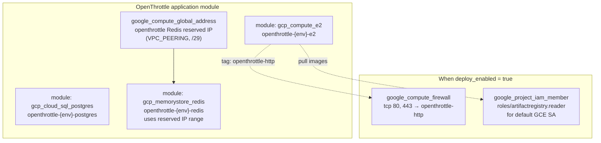
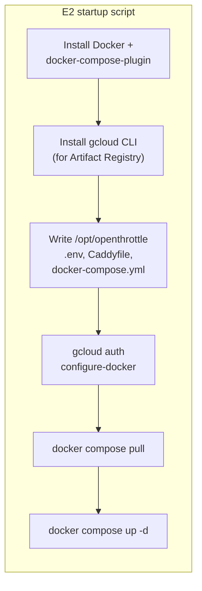
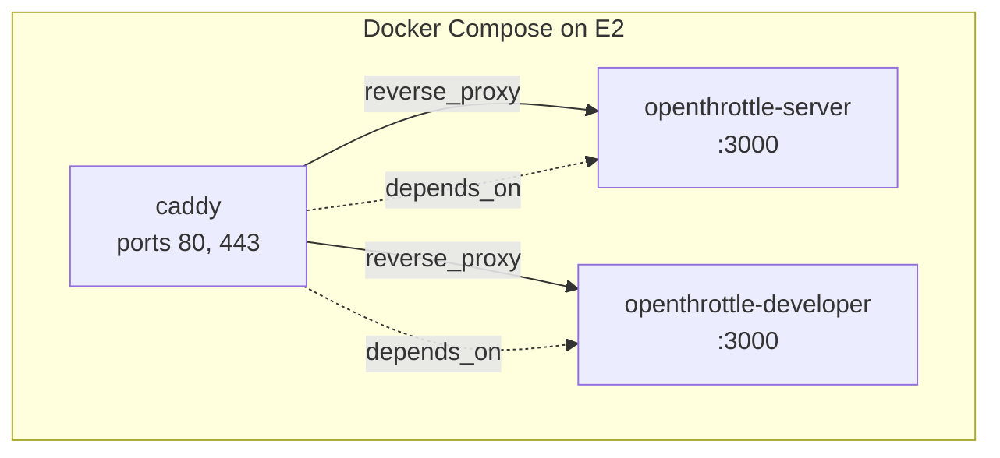
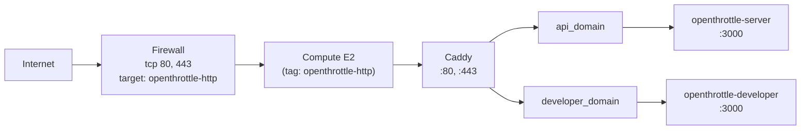
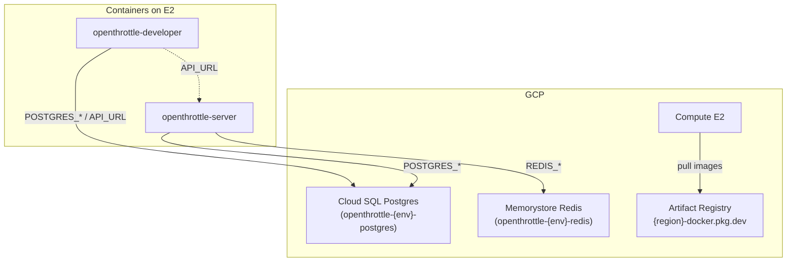

# OpenThrottle infrastructure and request flow

This document describes the Terraform composition, optional deploy path, request flow, and data dependencies for `infra/applications/openthrottle`.

## Terraform module composition

The application module composes a reserved IP for Redis, Cloud SQL Postgres, Compute E2, Memorystore Redis, and (when `deploy_enabled`) firewall and Artifact Registry IAM.

## Optional deploy path (startup → Docker → Compose)

When `deploy_enabled = true`, the E2 instance receives a startup script that installs Docker, writes config from Terraform, and runs Caddy + openthrottle-server + openthrottle-developer via Docker Compose.

## Request flow

Traffic from the Internet hits the firewall (ports 80/443), then the E2 instance. Caddy terminates TLS and reverse-proxies by hostname to the server or developer app.

- **api_domain** (e.g. `api.staging.example.com`) → Caddy → `openthrottle-server:3000`
- **developer_domain** (e.g. `developer.staging.example.com`) → Caddy → `openthrottle-developer:3000`

## Data dependencies

Postgres and Redis are created by Terraform and used by the server (and developer app when needed). The E2 instance pulls container images from Artifact Registry when `deploy_enabled = true`.

- **Postgres**: Used by openthrottle-server (and openthrottle-developer for MCP/GraphQL). Connection details come from Terraform into the startup script and `.env`.
- **Redis**: Used by openthrottle-server. Host/port from Memorystore module into startup script and `.env`.
- **Artifact Registry**: E2 default service account has `roles/artifactregistry.reader`; startup script runs `gcloud auth configure-docker` then `docker compose pull`.
