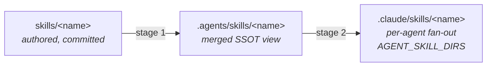

# 🔄 skill-sync

The skill that manages our **agent-skills architecture** — install it in any OpenThrottle repo and every AI tool (Claude Code, Cursor, Codex, Grok Build, OpenCode, VSCode/Copilot, Gemini CLI, …) gets the same skills, laid out the same way, kept out of git.

> [!TIP]
>
> This skill exists to prevent _inconsistent_ installs — e.g. one teammate installing a skill "for Cursor" and another "for Claude." Everything installs to one place (`.agents/skills/`), and the sync fans it out deterministically.

## The layout it manages



- **`skills/`** — skills this repo authors (committed).
- **`.agents/skills/`** — the merged SSOT view most CLIs read in-repo (Claude Code, Cursor 2.4+, Codex, OpenCode, …): real directories are `npx skills` installs (lockfile-owned, never touched by the sync); symlinks are the repo's own `skills/*` (generated). A name collision between the two is an error.
- **`.claude/skills/`** (and any other configured agent folders) — generated symlinks for the CLIs that read a `.claude`-style dir rather than `.agents/skills/` (e.g. Grok Build, and Cursor which also reads `.claude/skills`). `.agents/skills/` + `.claude/skills/` are the two near-universal in-repo targets; several CLIs additionally read per-tool global dirs (`~/.claude/skills`, `~/.codex/skills`, `~/.grok/skills`), which are outside this repo's layout.

Skills travel between repos by **install, never by symlink** — each repo runs `npx skills add openthrottle/monorepo --skill <name> --agent universal` and owns its own lockfile.

## Quick start

```bash
# One-time, in any OpenThrottle repo (note: no --agent flag for THIS skill)
npx skills add openthrottle/monorepo --skill skill-sync

# Everything else installs universal-only
npx skills add <owner>/<repo> --skill <name> --agent universal

# Build the layout (idempotent)
bash .agents/skills/skill-sync/scripts/sync.sh

# Validate it (CI drift gate — exits 1 on violations)
bash .agents/skills/skill-sync/scripts/sync.sh --check

# Tear it down
bash .agents/skills/skill-sync/scripts/cleanup.sh
```

## Configuration

`AGENT_SKILL_DIRS` (space-separated env var) overrides the fan-out targets without editing the installed skill — default is `.claude/skills`:

```bash
AGENT_SKILL_DIRS=".claude/skills .windsurf/skills" bash .agents/skills/skill-sync/scripts/sync.sh
```

## What it writes

Symlinks and a single static `.gitignore` block — nothing else. The block is deterministic and never churns per-skill:

```gitignore
# Agent resources - skill-sync
.agents/skills/*
!.agents/skills/*/
.claude/skills/
```

`.agents/skills/*` + `!.agents/skills/*/` ignores our authored symlinks while keeping the external install _directories_ committed (git treats a symlink as a file, not a directory); each fan-out dir (`.claude/skills/` by default) is fully generated, so it's ignored wholesale. There is **no** `.gitignore-symlinks` ledger — on-disk type is the source of truth (symlink = generated, real dir = external install), so the sync derives renames and removals from the filesystem. `.agents/skills/` real directories and `skills-lock.json` are never touched, so the skills CLI's lockfile stays authoritative for external skills.

## In the OpenThrottle repo itself

The skill runs from its source location (`bash skills/skill-sync/scripts/sync.sh`), and CI runs sync + `--check` on every PR as the **agent-skills SSOT drift gate**. The `scripts/symlink-*.sh` entry points are thin wrappers that delegate here, kept for service `setup.sh` compatibility.

See [`SKILL.md`](./SKILL.md) for the full rules and the invariants `--check` enforces.
